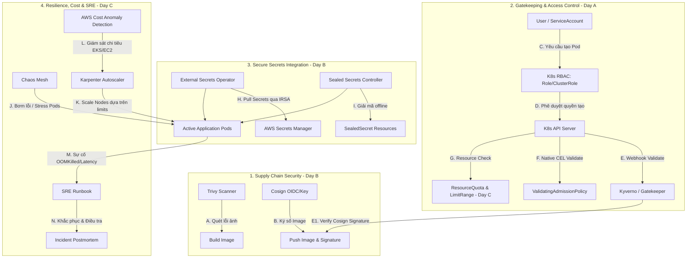

# Tài Liệu Tổng Ôn Kiến Thức: Kubernetes Security, Governance & Operations (Week 10)

Tài liệu này hệ thống hóa toàn bộ kiến thức của **Tuần 10 (Day A, Day B, Day C)**, liên kết chặt chẽ các mảnh ghép về Access Control (RBAC, Admission Controllers), Secret Management (AWS Secrets Manager, ESO, Sealed Secrets), Supply Chain Security (Trivy, Cosign), Resource Guardrails (ResourceQuota, LimitRange), Chaos Engineering, AWS Cost Guard và Quy trình SRE (Runbook, Postmortem) thành một hệ sinh thái an toàn và bền bỉ.

---

## 1. Sơ Đồ Liên Kết Hệ Thống Tuần 10 (Week 10 Architecture Map)

Sơ đồ dưới đây biểu diễn cách các cấu hình bảo mật, chính sách quản trị và công cụ vận hành của Tuần 10 tương tác chặt chẽ với nhau:

---

## 2. Sự Tương Tác và Liên Kết Logic Giữa Các Khối Kiến Thức

Hệ thống bảo mật và quản trị của Tuần 10 hoạt động dựa trên các chuỗi liên kết logic sau:

### 2.1. Chuỗi Bảo Mật Chuỗi Cung Ứng & Admission Control (Day B ➔ Day A)
*   **Bảo vệ Registry (Trivy & Cosign):** Trong CI pipeline, **Trivy** đảm bảo mã nguồn và các packages sạch không chứa lỗ hổng bảo mật. **Cosign** sau đó ký số đóng dấu xác nhận ảnh sạch lên Registry.
*   **Chốt chặn Cluster (Kyverno / Gatekeeper):** Khi ArgoCD deploy, K8s API Server nhận request. **Kyverno/Gatekeeper** chặn lại và thực hiện xác thực chữ ký của Cosign. Nếu ảnh container chưa được ký (tức là chưa qua bước quét Trivy của CI pipeline hoặc do hacker tự đẩy lên), Admission Webhook sẽ chặn đứng không cho tạo Pod.

### 2.2. Chuỗi Kiểm Soát Quyền Hạn & Cấu Hình Payload (Day A ➔ Day C)
*   **RBAC kiểm tra danh tính:** API Server dùng **RBAC** (Role, ClusterRole, RoleBinding) để xác định xem User/ServiceAccount có quyền TẠO (`create`) Pod hay không.
*   **Policy Engines kiểm tra payload:** Dù User được RBAC cấp quyền tạo Pod, request vẫn phải đi qua **VAP (ValidatingAdmissionPolicy)** hoặc **Kyverno** để kiểm tra sâu cấu trúc manifest (ví dụ: container có bị chạy với quyền root không, có khai báo CPU/RAM request và limits không).
*   **Guardrails áp đặt giới hạn:** Đồng thời, API Server đối chiếu với **ResourceQuota** và **LimitRange** của Namespace để đảm bảo Pod mới không làm cạn kiệt tài nguyên của cluster. Nếu thiếu limits, `LimitRange` tự động bổ sung cấu hình mặc định.

### 2.3. Chuỗi Quản Lý Thông Tin Nhạy Cảm & Phân Quyền EKS (Day B ➔ Day A)
*   Để Pod kết nối database an toàn mà không bị lộ mật khẩu, **External Secrets Operator (ESO)** được deploy.
*   Để ESO đọc được dữ liệu từ **AWS Secrets Manager**, ta phải cấu hình cơ chế IAM Roles for Service Accounts (IRSA).
*   Cơ chế này liên kết trực tiếp với **RBAC** thông qua việc gán ServiceAccount cụ thể cho ESO Pods. ESO sau đó đồng bộ hóa các secrets về thành K8s Secrets nội bộ để mount vào Pod ứng dụng theo chu kỳ **`refreshInterval`** (để tự động đồng bộ theo chu kỳ xoay vòng khóa - secrets rotation).
*   Với các secret tĩnh cần lưu trữ GitOps, ta dùng **Sealed Secrets** để mã hóa bất đối xứng trước khi commit lên Git.

### 2.4. Chuỗi Đảm Bảo Độ Bền Bỉ, Tối Ưu Chi Phí & SRE (Day C)
*   Khi ứng dụng đã chạy an toàn và bảo mật, chúng ta sử dụng **Chaos Mesh** để chèn lỗi (kill pod, latency, stress RAM) nhằm kiểm tra khả năng chịu lỗi của hệ thống.
*   Khi Chaos Mesh stress RAM hoặc hạ gục Pod, **Karpenter** sẽ tự động scale-out tạo thêm Node mới dựa trên cấu hình tài nguyên của Pod (được định hình bởi **LimitRange**).
*   Nếu việc auto-scaling diễn ra quá đà gây tốn kém chi phí, **AWS Cost Anomaly Detection** sẽ phát hiện điểm bất thường chi tiêu bằng Machine Learning và gửi cảnh báo về Slack của SRE.
*   Khi xảy ra lỗi thực tế (như Pod bị `OOMKilled` do stress RAM), kỹ sư SRE lập tức sử dụng **Runbook** để giảm thiểu thiệt hại, sau đó viết biên bản phân tích sự cố không đổ lỗi (**Blameless Postmortem**) để cải tiến các cấu hình ResourceQuota, LimitRange hoặc sửa lỗi Memory Leak trong code ứng dụng.

---

## 3. Các Kịch Bản Vận Hành Toàn Diện Tuần 10 (Week 10 Scenarios)

### Kịch bản 1: Quy trình Deploy Ứng Dụng Đóng Kín An Toàn (Secure GitOps Pipeline)
1.  **CI Pipeline (Day B):** Docker build image ➔ **Trivy** quét CVE ➔ **Cosign** ký số Keyless sử dụng OIDC token của GitHub Actions runner ➔ Push image & signature lên ECR.
2.  **GitOps Sync:** ArgoCD apply manifest lên Cluster.
3.  **Authentication (Day A):** API Server xác thực bằng **RBAC**, cấp quyền cho ArgoCD tạo tài nguyên.
4.  **Admission Control (Day A):** **Kyverno** chặn lại để xác thực chữ ký Cosign ➔ **ValidatingAdmissionPolicy** sử dụng biểu thức CEL kiểm tra xem container có chạy quyền non-root hay không.
5.  **Resource Allocation (Day C):** API Server đối chiếu request CPU/Memory với **LimitRange** và **ResourceQuota** ➔ Cấp phép tạo Pod.
6.  **Secrets Inject (Day B):** **ESO** gọi API AWS Secrets Manager kéo database credentials về giải mã thành K8s Secret mount vào Pod ➔ Ứng dụng chạy thành công.

### Kịch bản 2: Sự Cố Trực Chiến và Quy Trình SRE (SRE Incident Response)
1.  **Chaos Test (Day C):** **Chaos Mesh** kích hoạt kịch bản stress Memory Pod ứng dụng.
2.  **Hệ thống sụp đổ:** RAM vượt ngưỡng ➔ Hệ điều hành kích hoạt OOM-killer giết Pod ➔ Trạng thái hiển thị `OOMKilled (Exit Code 137)`.
3.  **Kích hoạt SRE Runbook (Day C):** Kỹ sư trực chiến mở tài liệu **Runbook** xử lý OOMKilled ➔ Đi theo các bước kiểm tra logs, Grafana ➔ Thực hiện giải pháp khắc phục tạm thời là tăng giới hạn limits trong `LimitRange` của Namespace.
4.  **Tối ưu hóa chi phí (Day C):** Khi limit tăng ➔ **Karpenter** scale node EC2 mới ➔ **AWS Cost Anomaly Detection** nhận diện chi phí tăng vọt gửi cảnh báo Slack ➔ Đội ngũ SRE rà soát lại cấu hình hạ tầng.
5.  **Họp rút kinh nghiệm (Day C):** Đội ngũ tổ chức họp và viết **Blameless Postmortem** ➔ Phát hiện lỗi rò rỉ bộ nhớ (memory leak) của code ứng dụng ➔ Tạo ticket yêu cầu Dev sửa code thay vì tiếp tục tăng tài nguyên vô ích.
