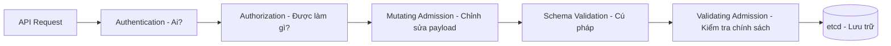
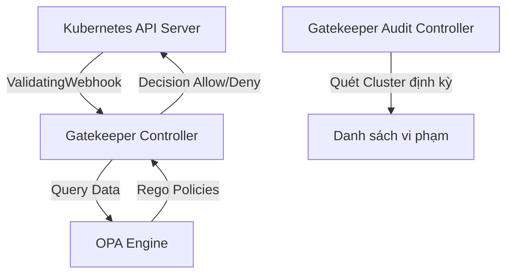

# Tài Liệu Lý Thuyết: Kubernetes RBAC & Policy Enforcement (OPA, Gatekeeper, Kyverno, ValidatingAdmissionPolicy)

---

## 1. Kubernetes Authorization & RBAC (Role-Based Access Control)

### 1.1. Tổng quan về Cơ chế Kiểm soát Truy cập (AuthN, AuthZ, Admission Control)
Khi một API request được gửi đến Kubernetes API Server, nó phải trải qua 3 giai đoạn chính trước khi được ghi vào `etcd`:

*   **Authentication (AuthN):** Xác định danh tính thực thể (User, Group, ServiceAccount).
*   **Authorization (AuthZ):** Xác định thực thể đó có quyền thực hiện hành động (Verb) trên tài nguyên (Resource) hay không thông qua **RBAC**, **ABAC**, hoặc **Webhook**.
*   **Admission Control:** Giai đoạn can thiệp trực tiếp vào nội dung Object. Gồm `Mutating` (thay đổi cấu hình mặc định) và `Validating` (phê duyệt hoặc bác bỏ yêu cầu dựa trên quy tắc bảo mật phức tạp mà RBAC không thể làm được).

---

### 1.2. Các Thành phần của RBAC
RBAC phân quyền dựa trên sự kết hợp của: **Who (Subject)** + **What (API Group, Resource, Verb)**.

*   **API Groups & Resources:** Tài nguyên K8s được nhóm theo API Groups (ví dụ: `apps` cho Deployment/StatefulSet, `""` (core) cho Pod/Service/ConfigMap).
*   **Verbs:** Các hành động (hành vi) như `get`, `list`, `watch`, `create`, `update`, `patch`, `delete`, `deletecollection`.
*   **Role & ClusterRole:** Định nghĩa **danh sách các quyền**:
    *   `Role`: Giới hạn quyền trong phạm vi một **Namespace** cụ thể.
    *   `ClusterRole`: Phân quyền trên toàn bộ **Cluster** (hoặc các tài nguyên non-namespaced như Node, PersistentVolume, CustomResourceDefinition).
*   **RoleBinding & ClusterRoleBinding:** Gán quyền (Role/ClusterRole) cho các **Subjects** (User, Group, ServiceAccount):
    *   `RoleBinding`: Áp dụng quyền trong một Namespace.
    *   `ClusterRoleBinding`: Áp dụng quyền trên toàn bộ Cluster.
    *   *Lưu ý nâng cao:* Bạn có thể dùng `RoleBinding` để liên kết một `ClusterRole` với một Subject. Khi đó, Subject chỉ có các quyền của `ClusterRole` trong Namespace chứa `RoleBinding` đó.

---

### 1.3. Rủi ro Bảo mật RBAC Thường gặp & Best Practices (Security Mindset)
Trong môi trường production, RBAC bị cấu hình sai là một trong những nguyên nhân hàng đầu dẫn đến **Privilege Escalation** (Leo thang đặc quyền).

#### Rủi ro 1: Sử dụng Ký tự Đại diện (Wildcard `*`) quá đà
*   **Nguy cơ:** Cấp quyền `*` cho `resources` hoặc `verbs` có thể vô tình cho phép kẻ tấn công thực thi các quyền nguy hiểm.
*   **Dẫn chứng:** Cấp quyền `*` trên `rules` tương đương với việc cấp quyền quản trị cao nhất.

#### Rủi ro 2: Quyền nguy hiểm dẫn đến Privilege Escalation
*   **Quyền tạo Pod (`create` pod) kết hợp với HostPath hoặc Privileged Container:**
    *   *Kịch bản:* Kẻ tấn công tạo một Pod mount root directory `/` của Worker Node vào Pod (`hostPath`). Từ Pod này, kẻ tấn công chroot vào Node và chiếm quyền kiểm soát Node (`root`).
*   **Quyền `bind` hoặc `escalate` trên Roles/ClusterRoles:**
    *   Cho phép một User gán quyền cho người khác cao hơn quyền hiện tại của chính họ.
*   **Quyền `impersonate` (Mạo danh):**
    *   Cho phép một tài khoản thực thi câu lệnh dưới danh nghĩa của một User hoặc Group khác (ví dụ: `system:masters`).

#### Production RBAC Hardening Guidelines:
1.  **Nguyên tắc Đặc quyền Tối thiểu (Least Privilege):** Không bao giờ dùng `cluster-admin` trừ khi thực sự cần thiết. Phân rã quyền chi tiết (chỉ cấp `get`, `list` thay vì `*`).
2.  **Tránh sử dụng nhóm mặc định `system:masters`:** Nhóm này bỏ qua mọi cơ chế kiểm tra RBAC của API Server.
3.  **Tách biệt ServiceAccount cho từng Workload:** Không sử dụng `default` ServiceAccount. Vô hiệu hóa tính năng tự động mount token (`automountServiceAccountToken: false`) nếu ứng dụng không cần tương tác với Kubernetes API.
4.  **Giới hạn quyền cập nhật Secrets:** Quyền `get` / `list` Secrets phải được bảo vệ cực kỳ nghiêm ngặt vì chúng chứa thông tin đăng nhập, key bảo mật.

---

## 2. Tại sao RBAC là chưa đủ? Sự ra đời của Policy Engines
RBAC chỉ trả lời câu hỏi: *"User X có quyền TẠO (create) Pod trong Namespace Y không?"*
RBAC **không thể** trả lời các câu hỏi sau:
*   *"Pod được tạo có mount thư mục nhạy cảm từ Node (`hostPath`) không?"*
*   *"Image của Container có được lấy từ private registry hợp lệ (ví dụ: `gcr.io/company/`) không hay từ Docker Hub công cộng?"*
*   *"Container có chạy với quyền root không (`runAsNonRoot: true`)?"*
*   *"Deployment có định nghĩa CPU/Memory Limit/Request rõ ràng không?"*

Để thực thi các quy tắc nghiệp vụ và bảo mật sâu ở mức cấu hình (Resource Spec), chúng ta cần các **Policy Engines** hoạt động tại giai đoạn **Admission Control**.

---

## 3. OPA Gatekeeper (Open Policy Agent)

### 3.1. OPA & Ngôn ngữ Rego
*   **Open Policy Agent (OPA):** Là một policy engine đa dụng mã nguồn mở, hoạt động độc lập với Kubernetes.
*   **Rego:** Ngôn ngữ khai báo (declarative query language) được OPA sử dụng để định nghĩa chính sách. Rego tập trung vào cấu trúc dữ liệu JSON/YAML phức tạp và đưa ra quyết định Allow/Deny.

### 3.2. Kiến trúc Gatekeeper trong Kubernetes
Gatekeeper là một controller tích hợp OPA vào Kubernetes Admission Webhook.

*   **Gatekeeper Controller:** Nhận AdmissionRequests từ API Server, gửi đến OPA engine để đánh giá dựa trên các policy đã nạp, sau đó trả về kết quả đồng ý/từ chối.
*   **Audit Controller:** Quét bất đồng bộ các tài nguyên hiện có trong Cluster để phát hiện các tài nguyên vi phạm policy mới được áp dụng.

### 3.3. ConstraintTemplate vs Constraint
Gatekeeper tách biệt logic kiểm tra và tham số cấu hình thành 2 Custom Resource Definitions (CRDs):

1.  **ConstraintTemplate:**
    *   Chứa **logic kiểm tra (Rego code)**.
    *   Định nghĩa Schema cho các tham số (parameters) truyền vào qua OpenAPI v3 schema.
    *   Nó giống như một "hàm" hoặc "class" định nghĩa logic chung.
2.  **Constraint:**
    *   Là một **thể hiện (instance)** của `ConstraintTemplate`.
    *   Truyền các giá trị thực tế cho tham số (ví dụ: danh sách các registries được phép).
    *   Chỉ định phạm vi áp dụng (ví dụ: áp dụng cho Namespace nào, Resource type nào thông qua selectors).

*Ưu điểm:* Tái sử dụng cao. Lập trình viên DevOps viết Rego một lần trong `ConstraintTemplate`, Security Engineer có thể tạo hàng chục `Constraint` với các tham số khác nhau mà không cần biết viết code Rego.

---

## 4. Kyverno

### 4.1. Kiến trúc & Triết lý thiết kế (Kubernetes-native)
Khác với Gatekeeper (phải học ngôn ngữ Rego mới), **Kyverno** được thiết kế dành riêng cho Kubernetes (Kubernetes-native).
*   **Không có ngôn ngữ mới:** Chính sách được viết hoàn toàn bằng **YAML** chuẩn, sử dụng các cú pháp biểu thức so sánh quen thuộc với Kubernetes manifests.
*   **Chức năng mở rộng:** Không chỉ **Validate** (xác thực), Kyverno còn có thể:
    *   **Mutate:** Tự động chỉnh sửa/bổ sung cấu hình (ví dụ: tự động chèn Sidecar container hoặc thêm label).
    *   **Generate:** Tự động tạo tài nguyên mới khi có tài nguyên khác xuất hiện (ví dụ: khi tạo một Namespace mới, Kyverno sẽ tự động tạo kèm NetworkPolicy, LimitRange, Secret sao chép từ namespace gốc).
    *   **Verify Images:** Tích hợp với **Cosign** để xác thực chữ ký số của container image nhằm chống giả mạo chuỗi cung ứng phần mềm (Software Supply Chain Security).

### 4.2. Cấu trúc Policy trong Kyverno
Kyverno hỗ trợ 2 scope chính:
*   `ClusterPolicy`: Áp dụng trên toàn bộ Cluster.
*   `Policy`: Chỉ áp dụng trong một Namespace nhất định.

Mỗi Policy bao gồm một hoặc nhiều **Rules**. Mỗi rule chứa:
*   `match`/`exclude`: Xác định đối tượng áp dụng.
*   Hành động: `validate`, `mutate`, `generate`, hoặc `verifyImages`.

---

## 5. ValidatingAdmissionPolicy (VAP) - Native K8s (1.30+ GA)

### 5.1. Tổng quan & Sự dịch chuyển sang Native Admission Control
*   **Bối cảnh:** Cả Gatekeeper và Kyverno đều dựa trên cơ chế **Mutating/Validating Admission Webhooks**. Điều này có nghĩa là API Server phải gửi HTTPS request ra ngoài đến Webhook Server (Controller của Gatekeeper/Kyverno).
*   **Vấn đề của Webhooks:**
    *   **Latency:** Độ trễ mạng làm chậm tốc độ xử lý của API Server.
    *   **Fail-Open vs Fail-Closed:** Nếu Webhook Server bị sập (down):
        *   *Fail-Open (Ignore):* Cho phép bỏ qua kiểm tra bảo mật (lỗ hổng lớn).
        *   *Fail-Closed (Fail):* Chặn toàn bộ việc deploy ứng dụng (gây downtime cho CI/CD).
    *   **Phức tạp trong vận hành:** Phải tự quản lý chứng chỉ SSL/TLS giữa API Server và Webhook, xử lý bài toán HA (High Availability) cho Webhook Pods.

Từ bản **Kubernetes 1.30**, **ValidatingAdmissionPolicy (VAP)** chính thức đạt trạng thái **GA (General Availability)**. VAP cho phép viết policy và thực thi **trực tiếp bên trong API Server** mà không cần gọi Webhook bên ngoài.

### 5.2. Ngôn ngữ CEL (Common Expression Language)
VAP sử dụng **CEL (Common Expression Language)** của Google để viết các biểu thức kiểm tra logic.
*   CEL cực kỳ nhẹ, thực thi nhanh và an sau (không bị lặp vô hạn, không tiêu tốn bộ nhớ vô tội vạ).
*   Ví dụ một biểu thức CEL đơn giản kiểm tra replicas tối đa:
    `object.spec.replicas <= 5`

### 5.3. ValidatingAdmissionPolicy vs ValidatingAdmissionPolicyBinding
Tương tự như Gatekeeper, VAP chia làm 2 phần:
1.  **ValidatingAdmissionPolicy:** Định nghĩa logic kiểm tra bằng biểu thức CEL và khai báo các tham số đầu vào (Parameter).
2.  **ValidatingAdmissionPolicyBinding:** Liên kết policy trên với các đối tượng cụ thể (Namespaces, Resource Types) và truyền tham số, đồng thời xác định hành động khi vi phạm (`Deny`, `Warn`, `Audit`).

---

## 6. Bảng so sánh Chi tiết: Gatekeeper vs Kyverno vs ValidatingAdmissionPolicy

| Tiêu chí | OPA Gatekeeper | Kyverno | ValidatingAdmissionPolicy (VAP) |
| :--- | :--- | :--- | :--- |
| **Kiến trúc** | Out-of-process Webhook | Out-of-process Webhook | In-process (Native API Server) |
| **Hiệu năng (Latency)** | Trung bình (do mạng & OPA Engine) | Trung bình (do mạng & Kyverno Engine) | **Cực cao** (Không tốn network roundtrip) |
| **Độ tin cậy (Downtime)** | Phụ thuộc vào Webhook Pod | Phụ thuộc vào Webhook Pod | **Cực cao** (Chạy trực tiếp trên control plane) |
| **Ngôn ngữ viết Policy** | **Rego** (Khó học, mạnh mẽ) | **YAML** (Dễ học, trực quan) | **CEL** (Dễ học, hiệu năng cao) |
| **Tính năng chính** | Validate, Audit | Validate, Mutate, Generate, Verify Image | **Chỉ Validate** (Tính năng Mutate đang phát triển riêng) |
| **Độ phức tạp vận hành** | Cao (Cài đặt CRDs, Webhook HA, SSL/TLS certificates) | Trung bình (Cài đặt Kyverno Controller, Webhook HA, Certs) | **Cực thấp** (Bật sẵn trên K8s 1.30+, cấu hình bằng YAML cơ bản) |
| **Mức độ phổ biến** | Rất cao (De facto standard lâu năm) | Rất cao (Được CNCF ưu chuộng cho Cloud Native) | Đang tăng trưởng cực nhanh (Xu hướng tương lai) |

---

## 7. Khuyến nghị Kiến trúc & Bảo mật từ Production-Ready Engineer
Khi xây dựng hệ thống Kubernetes lớn ở môi trường Enterprise/Production:

1.  **Sử dụng VAP làm Lớp Bảo vệ Đầu tiên (First Line of Defense):**
    *   Với các rule validate cơ bản (như ép buộc labels, chặn container chạy quyền root, giới hạn port, kiểm tra replicas...), hãy luôn ưu tiên **ValidatingAdmissionPolicy** vì hiệu năng vượt trội và không lo sập webhook.
2.  **Sử dụng Kyverno hoặc Gatekeeper cho các Nghiệp vụ Nâng cao:**
    *   Nếu cần tự động tiêm cấu hình (Mutating - như inject sidecar Linkerd/Istio, inject proxy credentials), tự động cấp phát tài nguyên khi tạo namespace (Generating), hoặc xác thực chữ ký ảnh (Cosign), hãy sử dụng **Kyverno**.
    *   Nếu doanh nghiệp của bạn đã chuẩn hóa toàn bộ hạ tầng (gồm cả Cloud, Terraform, Envoy, K8s) trên OPA Engine thì **Gatekeeper** là lựa chọn thống nhất tốt nhất để quản lý central policy.
3.  **Chiến lược Fail-Closed cho Môi trường Cực kỳ Bảo mật:**
    *   Nếu buộc phải dùng Webhooks (Gatekeeper/Kyverno), hãy cấu hình `failurePolicy: Fail` ở phía Webhook Configuration. Hãy chuẩn bị tối thiểu 3 replicas cho webhook pods trên các Node khác nhau (`podAntiAffinity`) và cấu hình Resource Requests/Limits đầy đủ để tránh OPA/Kyverno Webhook bị Out Of Memory (OOM) giết chết làm nghẽn toàn bộ Cluster.
