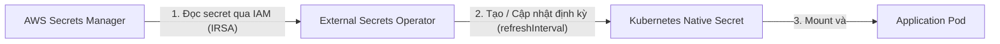
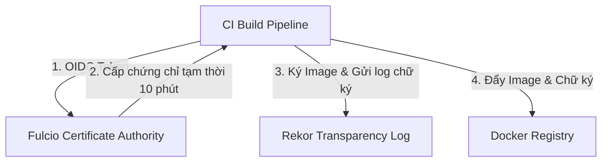

# Tài Liệu Lý Thuyết: Secrets Rotation & Supply Chain Security (AWS Secrets Manager, ESO, Sealed Secrets, Trivy, Cosign, Kyverno, SLSA)

---

## 1. Quản lý Secrets trong Kubernetes & Cơ chế Tự động Xoay Vòng (Rotation)

### 1.1. Thách thức của Kubernetes Native Secrets
Mặc dù Kubernetes cung cấp tài nguyên `Secret` để lưu trữ dữ liệu nhạy cảm (như API Keys, database credentials), cơ chế mặc định này gặp nhiều lỗ hổng lớn về bảo mật và vận hành:
*   **Base64 Không Phải Là Mã Hóa:** K8s Secrets chỉ được mã hóa dạng Base64. Bất kỳ ai có quyền truy cập API Server đọc manifest hoặc ghi logs đều có thể giải mã dễ dàng.
*   **Thiếu Cơ Chế Tự Động Xoay Vòng (Rotation):** Nếu thông tin đăng nhập database thay đổi, quản trị viên phải cập nhật thủ công các K8s Secrets và khởi động lại Pods.
*   **Rủi Ro GitOps:** Trực tiếp đưa K8s Secret manifest vào kho lưu trữ Git (Git repository) là cực kỳ nguy hiểm, vi phạm nguyên tắc bảo mật.
*   **Mã hóa etcd ở trạng thái nghỉ (Encryption at rest):** Dù etcd có thể cấu hình KMS để mã hóa, dữ liệu truyền đi và hiển thị vẫn ở dạng thô đối với người dùng có quyền trong namespace.

---

### 1.2. Giải pháp AWS Secrets Manager
AWS Secrets Manager là dịch vụ quản lý secret tập trung, bảo mật cao của AWS:
*   Mã hóa dữ liệu bằng AWS KMS keys.
*   Hỗ trợ tự động xoay vòng secret (automatic secrets rotation) tích hợp sẵn thông qua AWS Lambda (ví dụ: đổi mật khẩu cơ sở dữ liệu RDS định kỳ 30 ngày một lần).
*   Kiểm soát truy cập hạt nhân (fine-grained access control) bằng IAM Policies và Resource-based Policies.

---

### 1.3. External Secrets Operator (ESO)
**External Secrets Operator (ESO)** là một Kubernetes Operator đồng bộ hóa các secrets từ các API bên ngoài (như AWS Secrets Manager, HashiCorp Vault) vào Kubernetes native Secrets một cách an toàn.

#### Các Custom Resource Definitions (CRDs) Cốt lõi của ESO:
1.  **SecretStore:** Định nghĩa kết nối tới nhà cung cấp secret (ví dụ: cấu hình vùng AWS region, phương thức xác thực IAM Role). Tài nguyên này có phạm vi trong một **Namespace**.
2.  **ClusterSecretStore:** Tương tự như SecretStore nhưng có phạm vi trên toàn **Cluster**, cho phép nhiều namespaces tái sử dụng.
3.  **ExternalSecret:** Khai báo cụ thể secret nào cần lấy từ SecretStore (ví dụ: key `db-cred` từ AWS Secrets Manager) và ánh xạ thành K8s Secret nào.
    *   **`refreshInterval`:** Thuộc tính quan trọng xác định chu kỳ (ví dụ: `1h`, `5m`) ESO sẽ kéo dữ liệu mới nhất từ AWS Secrets Manager về. Giúp đồng bộ hóa chu kỳ xoay vòng khóa (Secrets Rotation).

---

### 1.4. Sealed Secrets (Phương án thay thế GitOps-native)
**Sealed Secrets (Bitnami)** giải quyết bài toán GitOps theo một hướng khác (offline-first):
*   **Cơ chế hoạt động:** Sử dụng mã hóa bất đối xứng (asymmetric encryption).
    1.  DevOps Engineer tải public key từ Sealed Secrets Controller trong Cluster.
    2.  Dùng CLI `kubeseal` mã hóa K8s Secret thô thành một `SealedSecret` (custom resource).
    3.  `SealedSecret` này an toàn tuyệt đối và có thể đẩy lên Git công khai.
    4.  Khi apply vào K8s, Sealed Secrets Controller sử dụng private key (được lưu an toàn trong cluster) để giải mã `SealedSecret` thành K8s `Secret` thông thường.
*   **So sánh ESO vs Sealed Secrets:**

| Tiêu chí | External Secrets Operator (ESO) | Sealed Secrets (Bitnami) |
| :--- | :--- | :--- |
| **Nguồn lưu trữ Secrets** | Central Vault (AWS Secrets Manager, Vault...) | Lưu trực tiếp trên Git repo dưới dạng mã hóa |
| **Cơ chế xoay vòng** | Tự động (qua `refreshInterval` và AWS Rotation) | Thủ công (phải tạo lại file SealedSecret mới khi đổi pass) |
| **Sự phụ thuộc** | Cần kết nối mạng tới cloud provider API | Hoàn toàn offline (sau khi deploy controller) |
| **Bảo mật IAM** | Cần phân quyền IAM Role cho Kubernetes Nodes/SA | Không cần phân quyền đám mây |

---

## 2. Supply Chain Security (Bảo mật chuỗi cung ứng phần mềm)

### 2.1. Tấn công Chuỗi Cung Ứng & SLSA Framework
*   **Thực trạng:** Kẻ tấn công ngày nay không chỉ nhắm vào ứng dụng đang chạy mà nhắm vào quy trình build code, các thư viện phụ thuộc (dependencies) hoặc quá trình đẩy container image lên registry (ví dụ: tấn công chèn mã độc vào build pipeline).
*   **SLSA (Supply Chain Levels for Software Artifacts):** Là một bộ khung tiêu chuẩn chung do Google và cộng đồng phát triển nhằm ngăn chặn các cuộc tấn công chuỗi cung ứng phần mềm.
    *   **SLSA Level 1:** Yêu cầu quy trình xây dựng (Build Process) phải tự động hóa hoàn toàn và tạo ra **Provenance** (Dữ liệu nguồn gốc chỉ ra artifact được build từ commit nào, bởi pipeline nào).
    *   **SLSA Level 2:** Yêu cầu thông tin Provenance phải được ký số bởi một Build Platform đáng tin cậy (ngăn chặn giả mạo nguồn gốc).
    *   **SLSA Level 3:** Yêu cầu Build Platform phải cô lập (hermetic) và ngăn chặn việc can thiệp từ người vận hành hay mã độc trong quá trình build.

---

### 2.2. Quét lỗ hổng Container Image bằng Trivy
Để đảm bảo container image không chứa các thư viện lỗi thời có lỗ hổng bảo mật (CVEs) hoặc chứa secrets bị lộ:
*   **Trivy (Aqua Security):** Là công cụ quét bảo mật đa năng, nhanh và chính xác nhất cho container images, filesystems, Git repos, và K8s configurations.
*   **Shift-Left Security:** Tích hợp Trivy trực tiếp vào quy trình CI (GitHub Actions, GitLab CI/CD). Nếu Trivy phát hiện lỗ hổng nghiêm trọng (Critical/High CVEs), pipeline sẽ tự động bị đánh sập (fail build), ngăn không cho build và push image lỗi lên Registry.
*   **Cơ chế Ngoại lệ (Vulnerability Exception):** Trong thực tế sản xuất, có những CVE chưa có bản vá (patch) hoặc không ảnh hưởng trực tiếp đến môi trường chạy. Chúng ta sử dụng file `.trivyignore` hoặc định dạng tiêu chuẩn **VEX (Vulnerability Exploitability eXchange)** để tạm thời loại trừ các CVE này khỏi danh sách đánh sập build.

---

## 3. Ký và Xác thực Container Image (Image Signing & Verification)

### 3.1. Tại sao cần Ký số Container Image?
Một hacker có thể đột nhập vào Docker Registry và đẩy đè một bản dựng độc hại lên image tag có sẵn (ví dụ: `production-v1`).
Nếu chỉ kiểm tra tên image, Kubernetes sẽ kéo bản dựng độc hại đó về chạy. **Cosign (Sigstore)** giải quyết vấn đề này bằng cách ký số vào container image khi build xong và kiểm tra chữ ký đó tại cổng Admission Webhook của Kubernetes.

---

### 3.2. Cosign: Hai phương thức ký số
Sigstore Cosign hỗ trợ 2 cơ chế ký số chính:

#### Phương pháp 1: Key-based Signing (Dựa trên cặp khóa)
*   **Cơ chế:** Tạo một cặp khóa private/public key cục bộ.
*   Sử dụng private key để ký image (`cosign sign --key cosign.key <image>`). Chữ ký được đẩy lên Docker Registry cùng với image.
*   Kubernetes Admission Webhook sử dụng public key (`cosign.pub`) để xác thực trước khi chạy Pod.
*   *Nhược điểm:* Phải quản lý, bảo mật và lưu trữ file private key tránh bị mất mát hoặc rò rỉ.

#### Phương pháp 2: Keyless Signing (Không dùng khóa dài hạn)
*   **Cơ chế:** Triển khai thông qua OIDC (OpenID Connect) tích hợp với các CI Providers đáng tin cậy (như GitHub Actions, GitLab CI).
    1.  Pipeline gửi yêu cầu kèm OIDC Identity Token của CI runner đến **Fulcio** (CA của Sigstore).
    2.  Fulcio xác thực định danh của pipeline và cấp một chứng chỉ số tạm thời (ephemeral certificate) có hiệu lực ngắn (thường là 10 phút).
    3.  Cosign dùng chứng chỉ tạm thời này để ký image.
    4.  Thông tin ký được ghi lại vào **Rekor** (Public Ledger / Transparency Log) - một sổ cái blockchain bất biến.
    5.  Khi xác thực, Kubernetes sẽ kiểm tra chứng chỉ tạm thời xem có thuộc về pipeline tin cậy không, và đối chiếu với Rekor log để đảm bảo không bị giả mạo. Không cần quản lý bất kỳ file key vật lý nào.

---

### 3.3. Kyverno Verify Images (Admission Webhook)
Để bắt buộc mọi container chạy trong cluster phải có chữ ký hợp lệ, ta sử dụng tính năng `verifyImages` của **Kyverno**:
*   Kyverno tích hợp thư viện Cosign bên trong.
*   Khi có yêu cầu tạo Pod, Kyverno Admission Webhook chặn lại, phân tích đường dẫn image, tìm kiếm metadata signature tương ứng trên registry.
*   Nó dùng public key cấu hình sẵn (hoặc OIDC identity config) để giải mã và xác thực chữ ký.
*   Nếu không có chữ ký hoặc chữ ký không khớp, Kyverno sẽ từ chối yêu cầu tạo Pod ngay lập tức.
