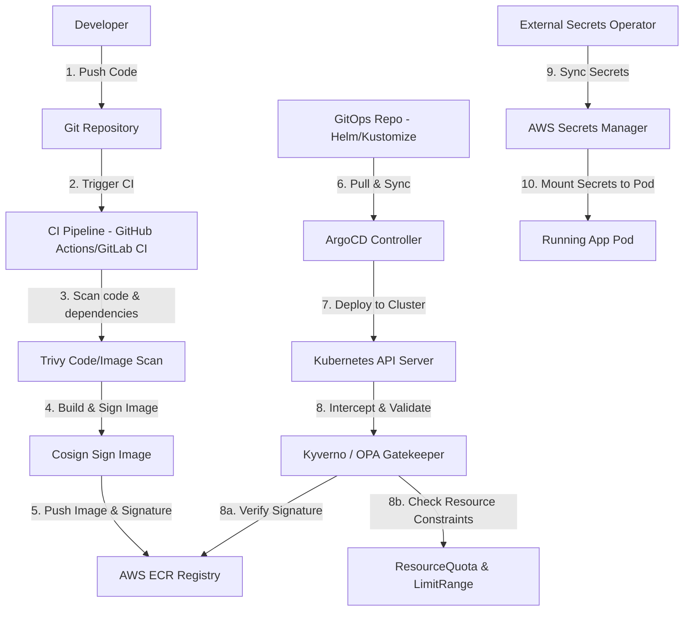

# Tài Liệu Lý Thuyết: Platform Integration, Resource Guardrails, Chaos Engineering, AWS Cost Guard & Runbook

---

## 1. Tích Hợp Toàn Stack Platform (W8 ➔ W10): Kiến Trúc Độc Lập & An Toàn
Một nền tảng cloud-native chuẩn sản xuất đòi hỏi sự tích hợp chặt chẽ của các mảnh ghép từ Infrastructure as Code, CI/CD, Security, GitOps, cho đến Resource Guardrails và Cost Optimization.

### 1.1. Luồng hoạt động đầu-cuối (End-to-End DevSecOps Pipeline)
Khi một dòng code được thay đổi, luồng bảo mật và vận hành diễn ra như sau:

1.  **Code Commit:** Developer đẩy code lên Git.
2.  **CI Scan & Build:** Pipeline kiểm tra tĩnh mã nguồn, chạy Trivy quét lỗ hổng thư viện phụ thuộc. Nếu an toàn, build container image.
3.  **Ký số (Image Signing):** Cosign ký số vào image (sử dụng Keyless OIDC của CI Runner hoặc Key từ AWS KMS). Push image và chữ ký lên AWS ECR.
4.  **GitOps Deployment:** ArgoCD phát hiện thay đổi cấu hình hạ tầng/ứng dụng, thực hiện đồng bộ (Sync) khai báo YAML vào Kubernetes Cluster.
5.  **Admission Verification:** Kyverno/OPA Gatekeeper chặn request của API Server:
    *   Xác thực chữ ký ảnh container chống giả mạo bằng Cosign public key.
    *   Kiểm tra tính hợp lệ của manifest (chạy quyền non-root, có resource limits...).
6.  **Resource Guardrails:** API Server đối chiếu cấu hình với `ResourceQuota` và `LimitRange` của Namespace để đảm bảo không vượt quá giới hạn tài nguyên vật lý được cấp phép.
7.  **Secrets Injection:** External Secrets Operator (ESO) sử dụng EKS IRSA để kéo Database Credentials từ AWS Secrets Manager về, giải mã trực tiếp thành K8s Secret để ứng dụng sử dụng.

---

## 2. Quản Trị Tài Nguyên Kubernetes: ResourceQuota & LimitRange

### 2.1. Tại sao cần quản trị tài nguyên ở cấp độ Namespace?
Nếu không có các chốt chặn giới hạn tài nguyên, cluster có thể gặp thảm họa **Noisy Neighbor**:
*   Một ứng dụng bị rò rỉ bộ nhớ (memory leak) có thể nuốt trọn toàn bộ RAM của Worker Node, khiến các ứng dụng quan trọng khác chạy cùng Node bị hệ điều hành OOM (Out Of Memory) giết chết.
*   Một dev deployment cấu hình nhầm replicas lên hàng trăm Pod sẽ chiếm dụng hết địa chỉ IP và CPU của Cluster, làm tê liệt quá trình deploy của các đội ngũ khác.

---

### 2.2. Kubernetes ResourceQuota
`ResourceQuota` định nghĩa giới hạn **tổng mức tiêu thụ tài nguyên** tối đa trong phạm vi một Namespace cụ thể.
*   **Tài nguyên quản lý:**
    *   **Compute:** Tổng CPU/Memory requests và limits của tất cả các Pods (ví dụ: tối đa 20 Core CPU và 64GB RAM cho cả Namespace `staging`).
    *   **Storage:** Tổng dung lượng PersistentVolumeClaims (PVC) được tạo (ví dụ: tối đa 500Gi SSD).
    *   **Object Count:** Tổng số lượng Pods, Services, Deployments, Secrets, ConfigMaps được phép tồn tại trong namespace.
*   **Hành động của API Server:** Khi người dùng tạo/sửa tài nguyên, API Server tính toán tổng tài nguyên hiện tại cộng thêm tài nguyên mới yêu cầu. Nếu vượt quá `ResourceQuota`, API Server sẽ trả về lỗi `403 Forbidden` và chặn đứng request.

---

### 2.3. Kubernetes LimitRange
Trong khi `ResourceQuota` quản lý tổng tài nguyên của cả Namespace, `LimitRange` quản lý **tài nguyên của từng cá thể** (Pod/Container) đơn lẻ trong Namespace đó.
*   **Các chức năng chính của LimitRange:**
    *   **Thiết lập Default Request/Limit:** Tự động chèn (inject) cấu hình CPU/Memory request và limit mặc định cho các Pod/Container nếu nhà phát triển quên không khai báo trong manifest.
    *   **Đặt giới hạn Min/Max:** Ràng buộc kích thước tối thiểu và tối đa của một Pod (ví dụ: không cho phép container yêu cầu RAM dưới 64Mi hoặc vượt quá 4Gi).
    *   **Giới hạn Storage:** Đặt kích thước PVC tối thiểu/tối đa.
*   **Hành động:** Hoạt động dưới dạng một *Mutating/Validating Admission Controller* mặc định của Kubernetes.

---

## 3. Chaos Engineering: Kỹ Nghệ Hỗn Loạn trong Kubernetes

### 3.1. Triết lý Chaos Engineering
Hệ thống phân tán lớn luôn luôn có lỗi xảy ra (mạng chập chờn, ổ cứng hỏng, Node sập, nghẽn mạng).
> "Nếu có gì đó có thể hỏng, nó sẽ hỏng." - Định luật Murphy.

Chaos Engineering là phương pháp **chủ động giả lập sự cố** ngay trên môi trường Staging hoặc Production để:
*   Kiểm tra xem hệ thống có tự phục hồi (self-healing) đúng như thiết kế không (ví dụ: K8s LivenessProbe phát hiện pod lỗi và restart, Auto Scaling tự động tạo Node mới).
*   Đánh giá tính HA của hệ thống (Multi-AZ, Load Balancer).
*   Kiểm chứng hệ thống giám sát (Monitoring/Alerting) có bắn cảnh báo kịp thời đến kỹ sư On-call khi sự cố xảy ra hay không.

### 3.2. So sánh các công cụ Chaos Engineering phổ biến

| Tiêu chí | Chaos Mesh | LitmusChaos |
| :--- | :--- | :--- |
| **Kiến trúc** | Kubernetes-native, sử dụng CRDs | Kubernetes-native, kiến trúc Microservices phức tạp hơn |
| **Giao diện (UI)** | Rất trực quan, dễ cấu hình đồ họa | Dashboard chuyên nghiệp, hỗ trợ quản lý dự án |
| **Hỗ trợ kịch bản** | Pod chaos, Network, IO, Kernel, DNS, Time | Tích hợp nhiều kịch bản mẫu qua ChaosHub (AWS, K8s, HTTP) |
| **Đối tượng phù hợp** | Các bài test nhanh, đơn giản, dễ cài đặt | Môi trường doanh nghiệp lớn cần quản lý workflows phức tạp |

---

## 4. AWS Cost Guard: AWS Cost Anomaly Detection & FinOps
Kubernetes giúp mở rộng tài nguyên cực kỳ nhanh, nhưng cũng là nguồn lãng phí chi phí đám mây hàng đầu do cấu hình dư thừa (Over-provisioning). **FinOps** (Financial Operations) ra đời nhằm tối ưu hóa chi phí này.

### 4.1. AWS Cost Anomaly Detection
Là một dịch vụ quản lý chi phí đám mây sử dụng Machine Learning của AWS để theo dõi lịch sử hóa đơn và phát hiện các điểm bất thường:
*   **Cơ chế hoạt động:**
    1.  Dịch vụ học các mô hình chi tiêu thông thường của bạn (ví dụ: chi phí chạy EC2, EKS hàng ngày).
    2.  Khi phát hiện chi phí đột ngột tăng vọt vượt quá ngưỡng dự kiến (do cấu hình sai script tạo tài nguyên, quên tắt môi trường test, bị DDOS làm tăng traffic đột biến, hoặc bị hack đào coin).
    3.  Tự động gửi cảnh báo khẩn cấp thông qua Amazon SNS, Email hoặc tích hợp trực tiếp vào kênh Slack/Microsoft Teams của DevOps team.
*   **Lợi ích:** Phát hiện chi tiêu bất thường trong vòng 24 giờ thay vì đợi đến cuối tháng khi nhận hóa đơn đắt đỏ.

### 4.2. Chiến lược Cost Optimization cho Kubernetes (FinOps)
1.  **Sử dụng Karpenter thay thế Cluster Autoscaler:** Karpenter là công cụ scale node mã nguồn mở của AWS dành cho K8s. Nó chọn Node Instance Type tối ưu nhất và nhanh nhất dựa trên Pod resources yêu cầu (ví dụ: thay vì scale lên 1 node `m5.large` đắt tiền, Karpenter có thể chọn 1 node `t3.medium` vừa đủ túi tiền).
2.  **Kube-downscaler:** Công cụ tự động giảm replicas của Deployments về 0 (hoặc 1) vào các giờ không làm việc (ví dụ: ban đêm từ 10h tối đến 7h sáng hôm sau ở môi trường Staging/Dev).
3.  **Spot Instances:** Sử dụng Spot Instances (chiết khấu lên tới 90% so với On-Demand) cho các stateless workloads (web frontends, background workers) có khả năng chịu đựng việc Node bị thu hồi bất ngờ.

---

## 5. Operations: SRE Runbook & Incident Postmortem

### 5.1. Phân biệt Runbook và Playbook
*   **Runbook:** Là tài liệu hướng dẫn kỹ thuật **từng bước cụ thể** (Step-by-step) để thực thi một tác vụ vận hành cụ thể (ví dụ: cách backup/restore database, cách scale up cluster thủ công, cách kích hoạt hệ thống Disaster Recovery). Thường dành cho các hoạt động định kỳ hoặc kịch bản kỹ thuật chi tiết.
*   **Playbook:** Là tài liệu hướng dẫn quy trình vận hành ở mức cao hơn, tập trung vào **phản ứng sự cố** (Incident Response) khi có alert (ví dụ: alert High CPU Pods -> Step 1: Kiểm tra log; Step 2: Restart pod; Step 3: Nếu không được, escalate lên L2). Nó giúp kỹ sư trực chiến (On-call) đưa ra quyết định nhanh chóng.

### 5.2. incident Postmortem (Biên bản phân tích sự cố theo chuẩn Google SRE)
Khi một sự cố nghiêm trọng xảy ra trên môi trường Production, sau khi đã khắc phục xong (Mitigated), DevOps/SRE team bắt buộc phải tổ chức họp rút kinh nghiệm và viết **Postmortem** với tinh thần **Blameless** (Không đổ lỗi cá nhân, tập trung vào cải tiến hệ thống).

#### Cấu trúc cốt lõi của một Postmortem:
1.  **Summary:** Tóm tắt sự cố (Chuyện gì xảy ra, thời gian downtime, ảnh hưởng tới bao nhiêu % người dùng).
2.  **Timeline:** Dòng thời gian chi tiết (Thời điểm phát sinh lỗi, thời điểm hệ thống cảnh báo, thời điểm kỹ sư tiếp nhận, thời điểm khắc phục xong).
3.  **Root Cause Analysis (RCA):** Phân tích nguyên nhân gốc rễ sâu xa (sử dụng phương pháp *5 Whys*).
4.  **Action Items:** Danh sách các đầu việc cần làm để ngăn chặn sự cố tương tự lặp lại (phải ghi rõ người chịu trách nhiệm và deadline hoàn thành). Gồm hành động khắc phục tức thời, và hành động cải tiến hệ thống lâu dài.
