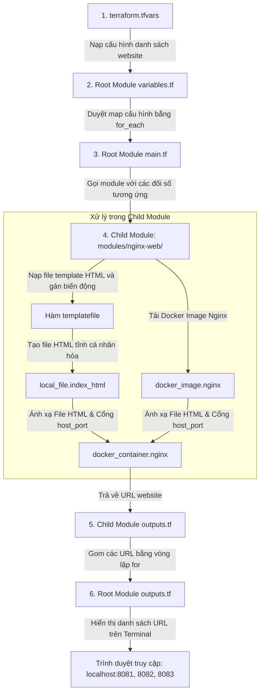

# 📝 Đề bài Thực hành: Multi-Website bằng Module & `for_each` (Tự thực hành)

---

## 💡 1. Mục Đích & Ý Nghĩa Của Bài Lab
Trong thực tế tại các doanh nghiệp, việc cấu hình thủ công từng máy chủ hay viết lặp đi lặp lại mã nguồn cho từng môi trường (Dev, Staging, Prod) là tối kỵ.
- **Mục đích:** Bài lab này giúp bạn làm quen với tư duy **Modularization (Mô-đun hóa)** và **Automation (Tự động hóa)**. 
- **Cách hoạt động:** Bạn chỉ cần viết **một bản thiết kế duy nhất** (Child Module) cho dịch vụ Nginx Web Server. Sau đó, ở Root Module, bạn sử dụng vòng lặp `for_each` để tạo hàng loạt website từ danh sách cấu hình động (tên website, cổng port, màu sắc, tiêu đề).
- **Lợi ích:** Khi cần thay đổi cấu hình Nginx (ví dụ nâng cấp phiên bản Nginx), bạn chỉ cần sửa **1 dòng duy nhất** trong Child Module, thay vì phải sửa thủ công ở mọi nơi.

---

## 🔄 2. Luồng Hoạt Động Của Hệ Thống (System Workflow)

Dưới đây là sơ đồ mô tả luồng xử lý của Terraform khi bạn chạy lệnh `apply`:



---

## 📐 3. Thứ Tự Tạo File Khuyến Nghị (Step-by-step Creation Order)
Để xây dựng hệ thống không bị lỗi phụ thuộc (dependency errors), bạn nên tạo các thư mục và file theo thứ tự logic dưới đây:

1. **Khởi động**: Tạo thư mục dự án `learn-terraform-docker-practice` và thư mục con `templates/`, `modules/nginx-web/`.
2. **File Template (Bước 1)**: Tạo `templates/index.html.tpl` để chuẩn bị sẵn khung HTML cho module đọc.
3. **Child Module (Bước 2)**: Viết Child Module trước vì Root Module sẽ cần tham chiếu đến nó.
   - Đầu tiên: Viết `modules/nginx-web/variables.tf` (Định nghĩa tham số đầu vào mà module cần nhận).
   - Tiếp theo: Viết `modules/nginx-web/main.tf` (Viết logic tạo ảnh, file HTML tĩnh và container Docker).
   - Cuối cùng: Viết `modules/nginx-web/outputs.tf` (Khai báo giá trị trả về để root module có thể sử dụng).
4. **Root Module (Bước 3)**:
   - Viết `providers.tf` và `backend.tf` để cấu hình môi trường chạy.
   - Viết `variables.tf` và `terraform.tfvars` để khai báo và nạp danh sách cấu hình các websites.
   - Viết `main.tf` để thực hiện vòng lặp `for_each` gọi Child Module.
   - Viết `outputs.tf` để in danh sách kết quả URL ra màn hình.

---

## 🛠️ Cấu Trúc Thư Mục Sau Khi Hoàn Thành

Khi bạn tạo xong tất cả các file, cấu trúc thư mục sẽ như thế này:

```text
learn-terraform-docker-practice/
├── providers.tf         # [Tự viết] Khai báo Docker và Local Providers
├── variables.tf         # [Tự viết] Khai báo các biến ở Root Module
├── terraform.tfvars     # [Tự viết] Gán giá trị cụ thể cho các biến
├── main.tf              # [Tự viết] Gọi module bằng for_each
├── outputs.tf           # [Tự viết] Output danh sách các website URLs
├── backend.tf           # [Tự viết] Cấu hình Local Backend
├── templates/
│   └── index.html.tpl   # [Đã có] Template HTML cho Website
└── modules/
    └── nginx-web/       # Child Module quản lý Nginx Web
        ├── variables.tf # [Tự viết] Định nghĩa biến của module & validation
        ├── main.tf      # [Tự viết] Resource docker_container, docker_image, local_file
        └── outputs.tf   # [Tự viết] Output của module
```

---

## 📋 Chi tiết các Bước Thực hiện & Khung Sườn Gợi ý (Skeletons)

Để hỗ trợ bạn học tập tốt nhất, dưới đây là chi tiết từng bước thực hiện kèm theo cấu trúc khung sườn (skeleton) của code. Nhiệm vụ của bạn là điền vào các phần dấu ba chấm `...` hoặc viết logic tương ứng.

---

### Bước 1: Tạo Template HTML (`templates/index.html.tpl`)
*Lưu ý: Bạn không cần viết code HTML, chỉ cần tạo file `templates/index.html.tpl` và dán chính xác nội dung này:*

```html
<!DOCTYPE html>
<html>
<head>
    <meta charset="utf-8">
    <title>${site_title}</title>
    <style>
        body {
            font-family: 'Segoe UI', Arial, sans-serif;
            background: ${bg_color};
            color: #ffffff;
            display: flex;
            justify-content: center;
            align-items: center;
            height: 100vh;
            margin: 0;
        }
        .card {
            background: rgba(0, 0, 0, 0.4);
            padding: 40px;
            border-radius: 16px;
            box-shadow: 0 10px 30px rgba(0,0,0,0.3);
            text-align: center;
            border: 1px solid rgba(255,255,255,0.1);
        }
        h1 { margin-top: 0; font-size: 2.5rem; }
        p { font-size: 1.2rem; opacity: 0.9; }
        .badge {
            background: #ffffff;
            color: #1e293b;
            padding: 6px 16px;
            border-radius: 20px;
            font-weight: bold;
            display: inline-block;
            margin-top: 15px;
        }
    </style>
</head>
<body>
    <div class="card">
        <h1>${welcome_message}</h1>
        <p>Chào mừng <strong>${admin_name}</strong> đã ghé thăm trang web!</p>
        <p>Website này được khởi tạo động qua Child Module & for_each.</p>
        <span class="badge">Port: ${port}</span>
    </div>
</body>
</html>
```

---

### Bước 2: Viết Child Module (`modules/nginx-web/`)

Module này là nơi xử lý logic tạo tài nguyên. Hãy viết 3 file sau:

#### 1. File `modules/nginx-web/variables.tf` (Khai báo biến đầu vào cho module)
Bạn cần khai báo các biến để nhận tham số từ bên ngoài truyền vào.

*Khung sườn gợi ý:*
```hcl
variable "site_name" {
  type        = string
  description = "Tên định danh duy nhất của website (chữ thường, viết liền)"
}

variable "host_port" {
  type        = number
  description = "Cổng port ánh xạ ngoài máy host"

  # 🚨 YÊU CẦU: Viết validation cho host_port
  validation {
    # Điều kiện: host_port phải lớn hơn 1024 và nhỏ hơn hoặc bằng 65535
    condition     = ...
    error_message = "Cổng host_port phải lớn hơn 1024 (cổng không đặc quyền) và nhỏ hơn hoặc bằng 65535."
  }
}

variable "html_template_path" {
  type        = string
  description = "Đường dẫn tuyệt đối hoặc tương đối tới tệp index.html.tpl"
}

variable "admin_name" {
  type        = string
  description = "Tên quản trị viên hiển thị trên trang web"
  default     = "Admin"
}

variable "site_title" {
  type        = string
  description = "Tiêu đề HTML của website"
}

variable "bg_color" {
  type        = string
  description = "Màu nền CSS của trang web"
  default     = "#1e293b"
}

variable "welcome_message" {
  type        = string
  description = "Lời chào hiển thị ở tiêu đề trang chính"
}
```

#### 2. File `modules/nginx-web/main.tf` (Định nghĩa tài nguyên của module)
Tài nguyên cần tạo gồm: Docker image Nginx, File index.html được sinh ra, và Docker container.

*Khung sườn gợi ý:*
```hcl
# A. Tải Docker Image Nginx
resource "docker_image" "nginx" {
  name         = "nginx:alpine"
  keep_locally = true
}

# B. Tạo file index.html cục bộ sử dụng hàm templatefile()
resource "local_file" "index_html" {
  # Định dạng tên file: "modules/nginx-web/index-<site_name>.html"
  filename = "${path.module}/index-$${var.site_name}.html"

  # Sử dụng hàm templatefile() để truyền variables vào template
  content  = templatefile(..., {
    site_title      = var.site_title
    bg_color        = var.bg_color
    welcome_message = var.welcome_message
    admin_name      = var.admin_name
    port            = var.host_port
  })
}

# C. Khởi chạy Docker Container
resource "docker_container" "nginx" {
  # 🚨 YÊU CẦU: Đặt tên container dạng "nginx-<site_name>" viết thường dùng hàm lower()
  name  = "nginx-${...}"
  image = docker_image.nginx.image_id

  # Ánh xạ cổng (External = host_port, Internal = 80)
  ports {
    internal = 80
    external = ...
  }

  # Ánh xạ File HTML vào trong container
  volumes {
    # 🚨 YÊU CẦU: Dùng hàm abspath() lấy đường dẫn tuyệt đối của file index_html được tạo ở trên
    host_path      = abspath(...)
    container_path = "/usr/share/nginx/html/index.html"
    read_only      = true
  }

  # 🚨 YÊU CẦU: Khai báo để container chỉ chạy sau khi file HTML đã tạo xong
  depends_on = [ ... ]
}
```

#### 3. File `modules/nginx-web/outputs.tf` (Xuất kết quả từ module)
Chúng ta cần trả về URL của website để root module thu thập.

*Khung sườn gợi ý:*
```hcl
output "container_id" {
  description = "ID của Docker container được tạo"
  value       = ...
}

output "website_url" {
  description = "Đường dẫn URL để truy cập vào container"
  # Định dạng: "http://localhost:<host_port>"
  value       = "http://localhost:${...}"
}
```

---

### Bước 3: Viết Root Module (`learn-terraform-docker-practice/`)

Root module sẽ là nơi cấu hình providers và lặp qua child module để chạy nhiều website.

#### 1. File `providers.tf`
Khai báo nguồn provider và phiên bản của Docker và Local.

*Khung sườn gợi ý:*
```hcl
terraform {
  required_version = ">= 1.2.0"
  required_providers {
    docker = {
      source  = "kreuzwerker/docker"
      version = "~> 3.0.2"
    }
    local = {
      source  = "hashicorp/local"
      version = "~> 2.5.1"
    }
  }
}

provider "docker" {}
provider "local" {}
```

#### 2. File `backend.tf`
Cấu hình local backend đơn giản.

*Khung sườn gợi ý:*
```hcl
terraform {
  backend "local" {
    path = "terraform.tfstate"
  }
}
```

#### 3. File `variables.tf` (Biến đầu vào của Root)
Định nghĩa cấu trúc dữ liệu của các website cần tạo.

*Khung sườn gợi ý:*
```hcl
variable "admin_name" {
  type        = string
  description = "Tên mặc định hiển thị của quản trị viên"
  default     = "Học viên AWS Accelerator"
}

variable "websites" {
  # 🚨 YÊU CẦU: Khai báo kiểu dữ liệu map của các object chứa 4 thuộc tính:
  # port (number), site_title (string), bg_color (string), welcome_message (string)
  type = map(object({
    port            = number
    site_title      = string
    bg_color        = string
    welcome_message = string
  }))
  description = "Cấu hình danh sách các website cần khởi tạo động"
}
```

#### 4. File `terraform.tfvars` (Gán giá trị thực tế)
Bạn gán giá trị thực tế cho biến `admin_name` và khai báo tối thiểu 3 website với các thuộc tính khác nhau để chạy thử.

*Khung sườn gợi ý:*
```hcl
admin_name = "Nhập tên của bạn ở đây"

websites = {
  "marketing" = {
    port            = 8081
    site_title      = "Marketing Portal"
    bg_color        = "orange" # Hoặc mã màu HEX "#f59e0b"
    welcome_message = "Chào mừng tới Trang Marketing!"
  },
  "developer" = {
    port            = 8082
    site_title      = "Developer Hub"
    bg_color        = "blue"
    welcome_message = "Chào mừng bạn tới Code Hub!"
  },
  "finance" = {
    port            = 8083
    site_title      = "Finance Portal"
    bg_color        = "green"
    welcome_message = "Chào mừng tới Hệ thống Tài chính!"
  }
}
```

#### 5. File `main.tf` (Gọi module bằng `for_each`)
Tại đây bạn cần trỏ đường dẫn tuyệt đối đến tệp template và gọi child module bằng vòng lặp `for_each`.

*Khung sườn gợi ý:*
```hcl
locals {
  # Lấy đường dẫn tệp index.html.tpl nằm trong thư mục templates/
  template_file_path = "${path.module}/templates/index.html.tpl"
}

module "nginx_websites" {
  # Đường dẫn trỏ đến child module
  source   = "./modules/nginx-web"
  
  # 🚨 YÊU CẦU: Dùng meta-argument for_each để lặp qua var.websites
  for_each = ...

  # map key sẽ là site_name ("marketing", "developer", "finance")
  site_name          = each.key 
  
  # map value chứa các thuộc tính tương ứng
  host_port          = each.value.port
  site_title         = each.value.site_title
  bg_color           = each.value.bg_color
  welcome_message    = each.value.welcome_message
  
  admin_name         = var.admin_name
  html_template_path = local.template_file_path
}
```

#### 6. File `outputs.tf` (Gom URL trả về)
Chúng ta muốn sau khi deploy thành công, Terraform hiển thị toàn bộ URL dưới dạng một map để dễ bấm truy cập.

*Khung sườn gợi ý:*
```hcl
output "website_urls" {
  description = "Danh sách URL truy cập vào các trang web đã deploy"
  
  # 🚨 YÊU CẦU: Dùng biểu thức HCL for loop để duyệt qua output "website_url" của module "nginx_websites"
  # Gợi ý cú pháp: { for k, v in module.nginx_websites : k => v.website_url }
  value       = ...
}
```

---

## 🚀 Các Bước Chạy & Kiểm tra Kết quả

Hãy mở Terminal hoặc PowerShell trong thư mục `learn-terraform-docker-practice/` và thực thi:

1. **Khởi tạo dự án:**
   ```bash
   terraform init
   ```
   *(Terraform sẽ tự tạo thư mục cục bộ `.terraform/` và tải providers/modules).*
   
2. **Định dạng code tự động:**
   ```bash
   terraform fmt -recursive
   ```
   *(Căn chỉnh lại mã nguồn gọn gàng, kiểm tra các tệp tin xem thụt lề đã thẳng chưa).*

3. **Xác thực cú pháp:**
   ```bash
   terraform validate
   ```
   *(Nếu có lỗi thiếu thuộc tính hoặc viết sai hàm, nó sẽ báo ngay tại đây).*

4. **Xem kế hoạch chạy:**
   ```bash
   terraform plan
   ```
   *(Xác nhận số lượng tài nguyên dự kiến tạo ra là 9 tài nguyên: 3 local_file + 3 docker_image + 3 docker_container).*

5. **Triển khai hạ tầng:**
   ```bash
   terraform apply
   ```
   *(Nhập `yes` và nhấn Enter để chạy).*

6. **Kiểm tra hoạt động:**
   - Mở trình duyệt web của bạn và truy cập các địa chỉ:
     - `http://localhost:8081` (Trang Marketing)
     - `http://localhost:8082` (Trang Developer)
     - `http://localhost:8083` (Trang Finance)
   - Xác nhận xem tiêu đề tab, màu nền và lời chào có hiển thị đúng với các tham số bạn cấu hình hay không.

7. **Dọn dẹp (Xóa hết container sau khi hoàn thành):**
   ```bash
   terraform destroy
   ```
   *(Nhập `yes` và nhấn Enter).*

Chúc bạn thực hành thành công! Nếu gặp bất kỳ lỗi nào ở bước `validate` hoặc `plan`, hãy dán lỗi đó lên đây để tôi hỗ trợ phân tích nhé!
