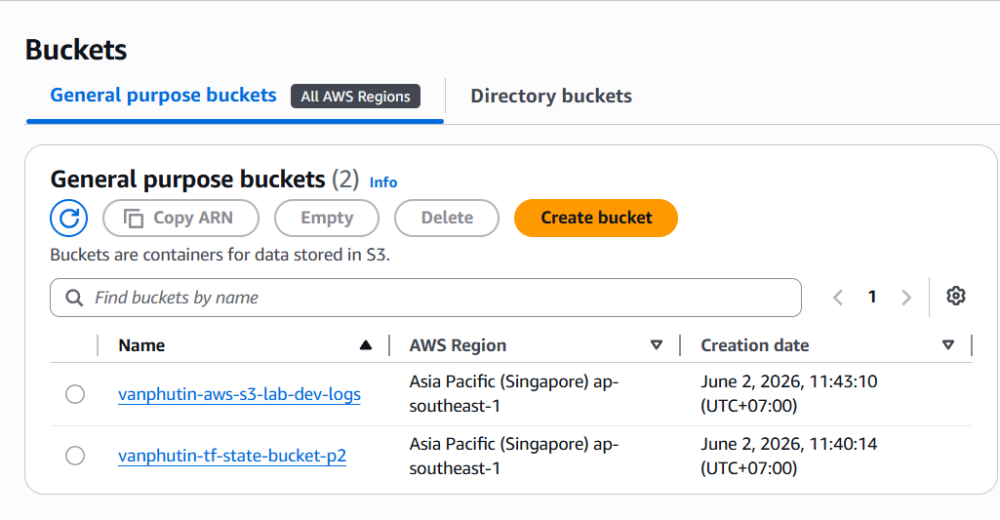
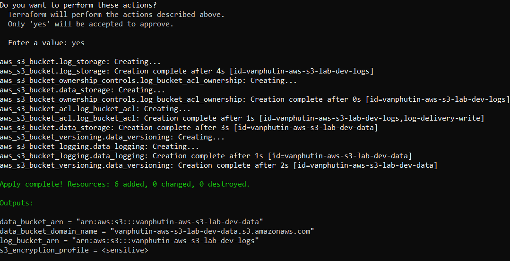
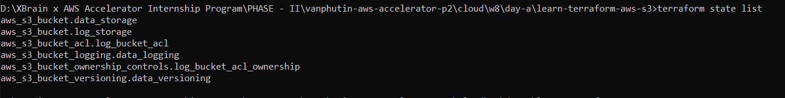
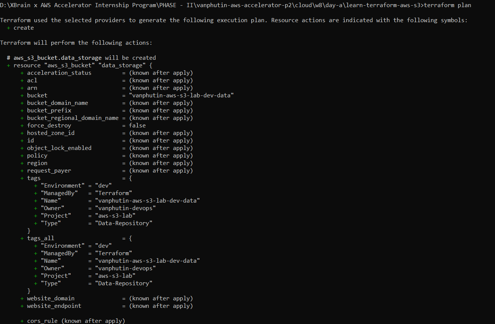
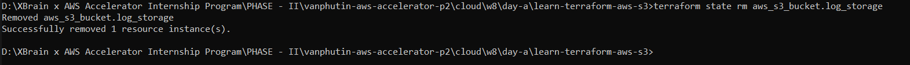
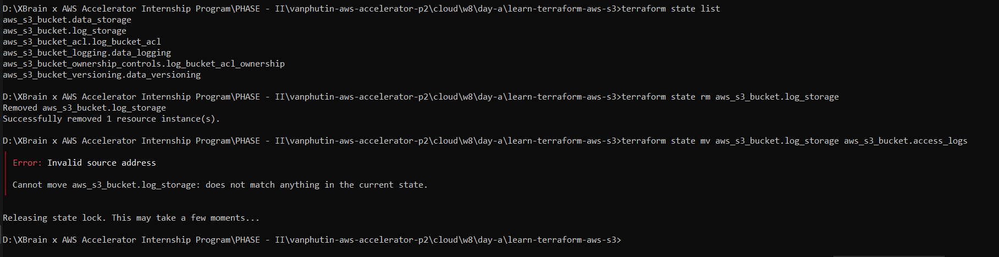
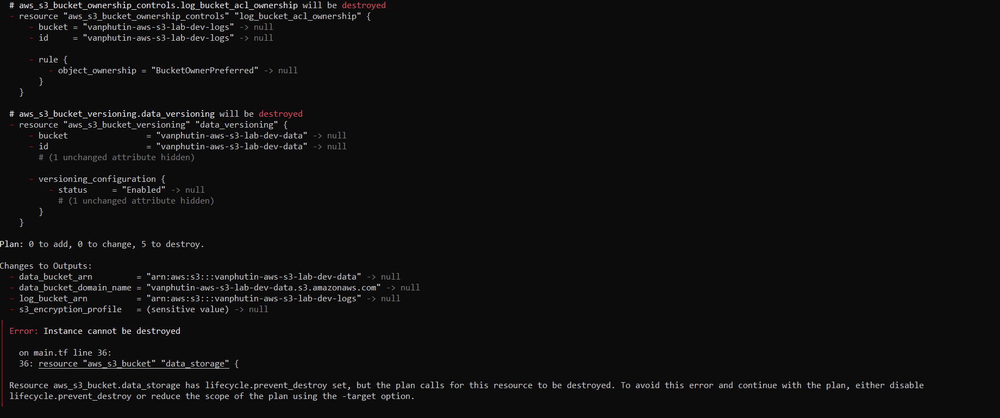
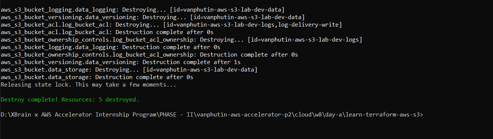

# 🛡️ Minh chứng Kỹ thuật: Secrets & Quản trị State CLI trong Terraform

## 🔑 1. Minh chứng Bảo mật thông tin nhạy cảm (Secrets Evidence)



## 💾 2. Minh chứng Quản trị State CLI & Import Block (State Management Evidence)



### Kịch bản B: Sử dụng `import` block hiện đại (Terraform 1.5+)
Nếu có một S3 Bucket đã được tạo sẵn bằng giao diện Console (AWS Web Console) mang tên `vanphutin-existing-bucket` và ta muốn đưa nó vào trong mã nguồn Terraform quản trị mà không cần xoá đi tạo lại:

**Bước 1:** Khai báo khối `import` trong file `main.tf` hoặc `imports.tf`:
```hcl
import {
  to = aws_s3_bucket.imported_storage
  id = "vanphutin-existing-bucket"
}

resource "aws_s3_bucket" "imported_storage" {
  bucket = "vanphutin-existing-bucket"
  # Các thuộc tính cấu hình khác của bucket...
}
```

**Bước 2:** Chạy lệnh `terraform plan` để sinh code tự động hoặc nhập trực tiếp tài nguyên:


### Kịch bản C: Loại bỏ tài nguyên ra khỏi State quản lý (`terraform state rm`)
Khi bạn muốn chuyển giao một tài nguyên (ví dụ: Log S3 Bucket) cho một đội ngũ khác quản trị độc lập, hoặc bạn muốn Terraform "quên" tài nguyên này đi mà **không được xoá tài nguyên thật trên AWS Cloud**:



### Kịch bản D: Đổi tên logic tài nguyên trong State (`terraform state mv`)
Khi bạn muốn tái cấu trúc (refactor) lại mã nguồn, đổi tên nhãn tài nguyên từ `aws_s3_bucket.log_storage` thành `aws_s3_bucket.access_logs` cho trực quan hơn mà **không muốn Terraform xoá bucket cũ đi và tạo lại bucket mới** (gây mất dữ liệu logs):


### Phá hủy tài nguyên bằng Terraform (`terraform destroy`)

Khi bạn gõ lệnh terraform destroy để dọn dẹp tài nguyên, Terraform lập tức nhận diện được lệnh xóa này sẽ làm mất Data Bucket chính. Để bảo vệ an toàn cho hệ thống của bạn, Terraform chặn đứng hành động này lại ngay lập tức và báo lỗi như trên.


Cách để vượt qua bảo vệ và Phá hủy tài nguyên thành công (khi thực sự muốn dọn dẹp): 
lifecycle {
  prevent_destroy = false
}