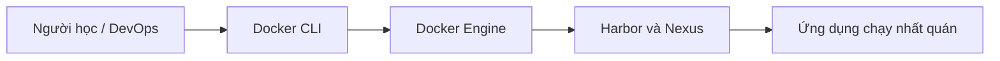

# Harbor và Nexus

Chapter: Docker Registry

## Mục tiêu

- Hiểu bản chất của `private registry`, `RBAC`, `proxy cache`.
- Biết áp dụng vào môi trường phát triển, CI/CD và production nhỏ.
- Tự chạy được command thực tế, đọc được output quan trọng và biết cách xử lý lỗi phổ biến.

## Lý thuyết

Trong Docker, chủ đề **Harbor và Nexus** cần được hiểu theo hướng thực chiến: không chỉ nhớ định nghĩa, mà phải biết đối tượng nào được tạo ra, dữ liệu nằm ở đâu, quyền hạn ra sao và khi lỗi thì kiểm tra từ lớp nào trước.

Các ý chính:

- Docker vận hành theo mô hình client-server: CLI gửi yêu cầu tới Docker Engine.
- Image là gói bất biến; container là tiến trình đang chạy dựa trên image.
- Network, volume, registry và runtime là các phần mở rộng quyết định chất lượng vận hành thực tế.
- Khi làm production, luôn phải nghĩ tới bảo mật, quan sát hệ thống, backup và khả năng tái tạo.

## Diagram



## Ví dụ

Tình huống: bạn cần kiểm chứng nhanh chủ đề **Harbor và Nexus** trên máy local trước khi đưa vào pipeline hoặc server lab.

```bash
docker tag app:1.0 harbor.local/library/app:1.0
```

## Giải thích command

| Thành phần | Giải thích |
|---|---|
| `docker tag` | Thành phần `docker tag` của command; đọc theo ngữ cảnh bài học để hiểu vai trò cụ thể. |
| `app:1.0` | Thành phần `app:1.0` của command; đọc theo ngữ cảnh bài học để hiểu vai trò cụ thể. |
| `harbor.local/library/app:1.0` | Thành phần `harbor.local/library/app:1.0` của command; đọc theo ngữ cảnh bài học để hiểu vai trò cụ thể. |

## Command thực tế

```bash
docker ps -a
docker images
docker inspect <ten-hoac-id>
docker logs <ten-container>
docker system df
```

Giải thích nhanh:

- `docker ps -a`: liệt kê cả container đang chạy và đã dừng.
- `docker images`: liệt kê image local, tag, image ID và kích thước.
- `docker inspect <ten-hoac-id>`: xem metadata JSON chi tiết của container, image, volume hoặc network.
- `docker logs <ten-container>`: đọc stdout/stderr của container.
- `docker system df`: xem Docker đang dùng bao nhiêu dung lượng đĩa.

## Common Mistakes

- Chạy container nhưng không đặt tên, sau đó khó debug trong lab nhiều container.
- Nhầm image với container: xóa container không có nghĩa là xóa image.
- Mount sai đường dẫn host làm ứng dụng trong container không thấy file.
- Publish trùng port host dẫn đến lỗi `port is already allocated`.
- Dùng tag `latest` trong production khiến bản chạy không tái lập được.

## Best Practices

- Đặt tên rõ ràng cho container, network và volume trong môi trường học/lab.
- Pin version image, ví dụ `nginx:1.27-alpine`, thay vì phụ thuộc `latest`.
- Luôn kiểm tra bằng `docker inspect` khi hành vi thực tế khác kỳ vọng.
- Tách dữ liệu bền vững vào volume; không dựa vào writable layer của container.
- Với production, chạy non-root, giới hạn tài nguyên, bật healthcheck và có chiến lược log.

## Bài tập thực hành

1. Chạy command ví dụ trong bài và ghi lại container/image/network/volume nào được tạo.
2. Dùng `docker inspect` để tìm ít nhất ba trường metadata quan trọng.
3. Cố tình tạo một lỗi nhỏ, ví dụ dùng sai port hoặc sai image tag, rồi mô tả cách bạn phát hiện.
4. Dọn dẹp tài nguyên lab bằng lệnh prune phù hợp, không xóa dữ liệu ngoài ý muốn.


## Tài liệu tham khảo

- Docker Docs: https://docs.docker.com/
- Docker CLI Reference: https://docs.docker.com/reference/cli/docker/
- OCI Specifications: https://opencontainers.org/
- Kubernetes Docs: https://kubernetes.io/docs/home/
