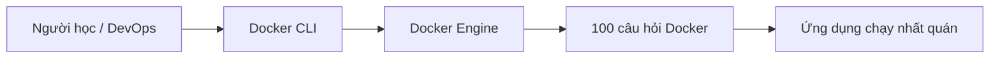

# 100 câu hỏi Docker

Chapter: Docker Interview

## Mục tiêu

- Hiểu bản chất của `foundation`, `image`, `container`, `network`, `storage`.
- Biết áp dụng vào môi trường phát triển, CI/CD và production nhỏ.
- Tự chạy được command thực tế, đọc được output quan trọng và biết cách xử lý lỗi phổ biến.

## Lý thuyết

Trong Docker, chủ đề **100 câu hỏi Docker** cần được hiểu theo hướng thực chiến: không chỉ nhớ định nghĩa, mà phải biết đối tượng nào được tạo ra, dữ liệu nằm ở đâu, quyền hạn ra sao và khi lỗi thì kiểm tra từ lớp nào trước.

Các ý chính:

- Docker vận hành theo mô hình client-server: CLI gửi yêu cầu tới Docker Engine.
- Image là gói bất biến; container là tiến trình đang chạy dựa trên image.
- Network, volume, registry và runtime là các phần mở rộng quyết định chất lượng vận hành thực tế.
- Khi làm production, luôn phải nghĩ tới bảo mật, quan sát hệ thống, backup và khả năng tái tạo.

## Diagram



## Ví dụ

Tình huống: bạn cần kiểm chứng nhanh chủ đề **100 câu hỏi Docker** trên máy local trước khi đưa vào pipeline hoặc server lab.

```bash
docker version
```

## Giải thích command

| Thành phần | Giải thích |
|---|---|
| `docker version` | Thành phần `docker version` của command; đọc theo ngữ cảnh bài học để hiểu vai trò cụ thể. |

## Command thực tế

```bash
docker ps -a
docker images
docker inspect <ten-hoac-id>
docker logs <ten-container>
docker system df
```

Giải thích nhanh:

- `docker ps -a`: liệt kê cả container đang chạy và đã dừng.
- `docker images`: liệt kê image local, tag, image ID và kích thước.
- `docker inspect <ten-hoac-id>`: xem metadata JSON chi tiết của container, image, volume hoặc network.
- `docker logs <ten-container>`: đọc stdout/stderr của container.
- `docker system df`: xem Docker đang dùng bao nhiêu dung lượng đĩa.

## Common Mistakes

- Chạy container nhưng không đặt tên, sau đó khó debug trong lab nhiều container.
- Nhầm image với container: xóa container không có nghĩa là xóa image.
- Mount sai đường dẫn host làm ứng dụng trong container không thấy file.
- Publish trùng port host dẫn đến lỗi `port is already allocated`.
- Dùng tag `latest` trong production khiến bản chạy không tái lập được.

## Best Practices

- Đặt tên rõ ràng cho container, network và volume trong môi trường học/lab.
- Pin version image, ví dụ `nginx:1.27-alpine`, thay vì phụ thuộc `latest`.
- Luôn kiểm tra bằng `docker inspect` khi hành vi thực tế khác kỳ vọng.
- Tách dữ liệu bền vững vào volume; không dựa vào writable layer của container.
- Với production, chạy non-root, giới hạn tài nguyên, bật healthcheck và có chiến lược log.

## Bài tập thực hành

1. Chạy command ví dụ trong bài và ghi lại container/image/network/volume nào được tạo.
2. Dùng `docker inspect` để tìm ít nhất ba trường metadata quan trọng.
3. Cố tình tạo một lỗi nhỏ, ví dụ dùng sai port hoặc sai image tag, rồi mô tả cách bạn phát hiện.
4. Dọn dẹp tài nguyên lab bằng lệnh prune phù hợp, không xóa dữ liệu ngoài ý muốn.


## 100 câu hỏi trọng tâm
1. Câu hỏi 1: Giải thích một khía cạnh Docker liên quan đến image, container, network, storage, security hoặc production. Trả lời mẫu: nêu khái niệm, ví dụ command, rủi ro thường gặp và cách kiểm chứng bằng `docker inspect`, `docker logs` hoặc `docker stats` khi phù hợp.
2. Câu hỏi 2: Giải thích một khía cạnh Docker liên quan đến image, container, network, storage, security hoặc production. Trả lời mẫu: nêu khái niệm, ví dụ command, rủi ro thường gặp và cách kiểm chứng bằng `docker inspect`, `docker logs` hoặc `docker stats` khi phù hợp.
3. Câu hỏi 3: Giải thích một khía cạnh Docker liên quan đến image, container, network, storage, security hoặc production. Trả lời mẫu: nêu khái niệm, ví dụ command, rủi ro thường gặp và cách kiểm chứng bằng `docker inspect`, `docker logs` hoặc `docker stats` khi phù hợp.
4. Câu hỏi 4: Giải thích một khía cạnh Docker liên quan đến image, container, network, storage, security hoặc production. Trả lời mẫu: nêu khái niệm, ví dụ command, rủi ro thường gặp và cách kiểm chứng bằng `docker inspect`, `docker logs` hoặc `docker stats` khi phù hợp.
5. Câu hỏi 5: Giải thích một khía cạnh Docker liên quan đến image, container, network, storage, security hoặc production. Trả lời mẫu: nêu khái niệm, ví dụ command, rủi ro thường gặp và cách kiểm chứng bằng `docker inspect`, `docker logs` hoặc `docker stats` khi phù hợp.
6. Câu hỏi 6: Giải thích một khía cạnh Docker liên quan đến image, container, network, storage, security hoặc production. Trả lời mẫu: nêu khái niệm, ví dụ command, rủi ro thường gặp và cách kiểm chứng bằng `docker inspect`, `docker logs` hoặc `docker stats` khi phù hợp.
7. Câu hỏi 7: Giải thích một khía cạnh Docker liên quan đến image, container, network, storage, security hoặc production. Trả lời mẫu: nêu khái niệm, ví dụ command, rủi ro thường gặp và cách kiểm chứng bằng `docker inspect`, `docker logs` hoặc `docker stats` khi phù hợp.
8. Câu hỏi 8: Giải thích một khía cạnh Docker liên quan đến image, container, network, storage, security hoặc production. Trả lời mẫu: nêu khái niệm, ví dụ command, rủi ro thường gặp và cách kiểm chứng bằng `docker inspect`, `docker logs` hoặc `docker stats` khi phù hợp.
9. Câu hỏi 9: Giải thích một khía cạnh Docker liên quan đến image, container, network, storage, security hoặc production. Trả lời mẫu: nêu khái niệm, ví dụ command, rủi ro thường gặp và cách kiểm chứng bằng `docker inspect`, `docker logs` hoặc `docker stats` khi phù hợp.
10. Câu hỏi 10: Giải thích một khía cạnh Docker liên quan đến image, container, network, storage, security hoặc production. Trả lời mẫu: nêu khái niệm, ví dụ command, rủi ro thường gặp và cách kiểm chứng bằng `docker inspect`, `docker logs` hoặc `docker stats` khi phù hợp.
11. Câu hỏi 11: Giải thích một khía cạnh Docker liên quan đến image, container, network, storage, security hoặc production. Trả lời mẫu: nêu khái niệm, ví dụ command, rủi ro thường gặp và cách kiểm chứng bằng `docker inspect`, `docker logs` hoặc `docker stats` khi phù hợp.
12. Câu hỏi 12: Giải thích một khía cạnh Docker liên quan đến image, container, network, storage, security hoặc production. Trả lời mẫu: nêu khái niệm, ví dụ command, rủi ro thường gặp và cách kiểm chứng bằng `docker inspect`, `docker logs` hoặc `docker stats` khi phù hợp.
13. Câu hỏi 13: Giải thích một khía cạnh Docker liên quan đến image, container, network, storage, security hoặc production. Trả lời mẫu: nêu khái niệm, ví dụ command, rủi ro thường gặp và cách kiểm chứng bằng `docker inspect`, `docker logs` hoặc `docker stats` khi phù hợp.
14. Câu hỏi 14: Giải thích một khía cạnh Docker liên quan đến image, container, network, storage, security hoặc production. Trả lời mẫu: nêu khái niệm, ví dụ command, rủi ro thường gặp và cách kiểm chứng bằng `docker inspect`, `docker logs` hoặc `docker stats` khi phù hợp.
15. Câu hỏi 15: Giải thích một khía cạnh Docker liên quan đến image, container, network, storage, security hoặc production. Trả lời mẫu: nêu khái niệm, ví dụ command, rủi ro thường gặp và cách kiểm chứng bằng `docker inspect`, `docker logs` hoặc `docker stats` khi phù hợp.
16. Câu hỏi 16: Giải thích một khía cạnh Docker liên quan đến image, container, network, storage, security hoặc production. Trả lời mẫu: nêu khái niệm, ví dụ command, rủi ro thường gặp và cách kiểm chứng bằng `docker inspect`, `docker logs` hoặc `docker stats` khi phù hợp.
17. Câu hỏi 17: Giải thích một khía cạnh Docker liên quan đến image, container, network, storage, security hoặc production. Trả lời mẫu: nêu khái niệm, ví dụ command, rủi ro thường gặp và cách kiểm chứng bằng `docker inspect`, `docker logs` hoặc `docker stats` khi phù hợp.
18. Câu hỏi 18: Giải thích một khía cạnh Docker liên quan đến image, container, network, storage, security hoặc production. Trả lời mẫu: nêu khái niệm, ví dụ command, rủi ro thường gặp và cách kiểm chứng bằng `docker inspect`, `docker logs` hoặc `docker stats` khi phù hợp.
19. Câu hỏi 19: Giải thích một khía cạnh Docker liên quan đến image, container, network, storage, security hoặc production. Trả lời mẫu: nêu khái niệm, ví dụ command, rủi ro thường gặp và cách kiểm chứng bằng `docker inspect`, `docker logs` hoặc `docker stats` khi phù hợp.
20. Câu hỏi 20: Giải thích một khía cạnh Docker liên quan đến image, container, network, storage, security hoặc production. Trả lời mẫu: nêu khái niệm, ví dụ command, rủi ro thường gặp và cách kiểm chứng bằng `docker inspect`, `docker logs` hoặc `docker stats` khi phù hợp.
21. Câu hỏi 21: Giải thích một khía cạnh Docker liên quan đến image, container, network, storage, security hoặc production. Trả lời mẫu: nêu khái niệm, ví dụ command, rủi ro thường gặp và cách kiểm chứng bằng `docker inspect`, `docker logs` hoặc `docker stats` khi phù hợp.
22. Câu hỏi 22: Giải thích một khía cạnh Docker liên quan đến image, container, network, storage, security hoặc production. Trả lời mẫu: nêu khái niệm, ví dụ command, rủi ro thường gặp và cách kiểm chứng bằng `docker inspect`, `docker logs` hoặc `docker stats` khi phù hợp.
23. Câu hỏi 23: Giải thích một khía cạnh Docker liên quan đến image, container, network, storage, security hoặc production. Trả lời mẫu: nêu khái niệm, ví dụ command, rủi ro thường gặp và cách kiểm chứng bằng `docker inspect`, `docker logs` hoặc `docker stats` khi phù hợp.
24. Câu hỏi 24: Giải thích một khía cạnh Docker liên quan đến image, container, network, storage, security hoặc production. Trả lời mẫu: nêu khái niệm, ví dụ command, rủi ro thường gặp và cách kiểm chứng bằng `docker inspect`, `docker logs` hoặc `docker stats` khi phù hợp.
25. Câu hỏi 25: Giải thích một khía cạnh Docker liên quan đến image, container, network, storage, security hoặc production. Trả lời mẫu: nêu khái niệm, ví dụ command, rủi ro thường gặp và cách kiểm chứng bằng `docker inspect`, `docker logs` hoặc `docker stats` khi phù hợp.
26. Câu hỏi 26: Giải thích một khía cạnh Docker liên quan đến image, container, network, storage, security hoặc production. Trả lời mẫu: nêu khái niệm, ví dụ command, rủi ro thường gặp và cách kiểm chứng bằng `docker inspect`, `docker logs` hoặc `docker stats` khi phù hợp.
27. Câu hỏi 27: Giải thích một khía cạnh Docker liên quan đến image, container, network, storage, security hoặc production. Trả lời mẫu: nêu khái niệm, ví dụ command, rủi ro thường gặp và cách kiểm chứng bằng `docker inspect`, `docker logs` hoặc `docker stats` khi phù hợp.
28. Câu hỏi 28: Giải thích một khía cạnh Docker liên quan đến image, container, network, storage, security hoặc production. Trả lời mẫu: nêu khái niệm, ví dụ command, rủi ro thường gặp và cách kiểm chứng bằng `docker inspect`, `docker logs` hoặc `docker stats` khi phù hợp.
29. Câu hỏi 29: Giải thích một khía cạnh Docker liên quan đến image, container, network, storage, security hoặc production. Trả lời mẫu: nêu khái niệm, ví dụ command, rủi ro thường gặp và cách kiểm chứng bằng `docker inspect`, `docker logs` hoặc `docker stats` khi phù hợp.
30. Câu hỏi 30: Giải thích một khía cạnh Docker liên quan đến image, container, network, storage, security hoặc production. Trả lời mẫu: nêu khái niệm, ví dụ command, rủi ro thường gặp và cách kiểm chứng bằng `docker inspect`, `docker logs` hoặc `docker stats` khi phù hợp.
31. Câu hỏi 31: Giải thích một khía cạnh Docker liên quan đến image, container, network, storage, security hoặc production. Trả lời mẫu: nêu khái niệm, ví dụ command, rủi ro thường gặp và cách kiểm chứng bằng `docker inspect`, `docker logs` hoặc `docker stats` khi phù hợp.
32. Câu hỏi 32: Giải thích một khía cạnh Docker liên quan đến image, container, network, storage, security hoặc production. Trả lời mẫu: nêu khái niệm, ví dụ command, rủi ro thường gặp và cách kiểm chứng bằng `docker inspect`, `docker logs` hoặc `docker stats` khi phù hợp.
33. Câu hỏi 33: Giải thích một khía cạnh Docker liên quan đến image, container, network, storage, security hoặc production. Trả lời mẫu: nêu khái niệm, ví dụ command, rủi ro thường gặp và cách kiểm chứng bằng `docker inspect`, `docker logs` hoặc `docker stats` khi phù hợp.
34. Câu hỏi 34: Giải thích một khía cạnh Docker liên quan đến image, container, network, storage, security hoặc production. Trả lời mẫu: nêu khái niệm, ví dụ command, rủi ro thường gặp và cách kiểm chứng bằng `docker inspect`, `docker logs` hoặc `docker stats` khi phù hợp.
35. Câu hỏi 35: Giải thích một khía cạnh Docker liên quan đến image, container, network, storage, security hoặc production. Trả lời mẫu: nêu khái niệm, ví dụ command, rủi ro thường gặp và cách kiểm chứng bằng `docker inspect`, `docker logs` hoặc `docker stats` khi phù hợp.
36. Câu hỏi 36: Giải thích một khía cạnh Docker liên quan đến image, container, network, storage, security hoặc production. Trả lời mẫu: nêu khái niệm, ví dụ command, rủi ro thường gặp và cách kiểm chứng bằng `docker inspect`, `docker logs` hoặc `docker stats` khi phù hợp.
37. Câu hỏi 37: Giải thích một khía cạnh Docker liên quan đến image, container, network, storage, security hoặc production. Trả lời mẫu: nêu khái niệm, ví dụ command, rủi ro thường gặp và cách kiểm chứng bằng `docker inspect`, `docker logs` hoặc `docker stats` khi phù hợp.
38. Câu hỏi 38: Giải thích một khía cạnh Docker liên quan đến image, container, network, storage, security hoặc production. Trả lời mẫu: nêu khái niệm, ví dụ command, rủi ro thường gặp và cách kiểm chứng bằng `docker inspect`, `docker logs` hoặc `docker stats` khi phù hợp.
39. Câu hỏi 39: Giải thích một khía cạnh Docker liên quan đến image, container, network, storage, security hoặc production. Trả lời mẫu: nêu khái niệm, ví dụ command, rủi ro thường gặp và cách kiểm chứng bằng `docker inspect`, `docker logs` hoặc `docker stats` khi phù hợp.
40. Câu hỏi 40: Giải thích một khía cạnh Docker liên quan đến image, container, network, storage, security hoặc production. Trả lời mẫu: nêu khái niệm, ví dụ command, rủi ro thường gặp và cách kiểm chứng bằng `docker inspect`, `docker logs` hoặc `docker stats` khi phù hợp.
41. Câu hỏi 41: Giải thích một khía cạnh Docker liên quan đến image, container, network, storage, security hoặc production. Trả lời mẫu: nêu khái niệm, ví dụ command, rủi ro thường gặp và cách kiểm chứng bằng `docker inspect`, `docker logs` hoặc `docker stats` khi phù hợp.
42. Câu hỏi 42: Giải thích một khía cạnh Docker liên quan đến image, container, network, storage, security hoặc production. Trả lời mẫu: nêu khái niệm, ví dụ command, rủi ro thường gặp và cách kiểm chứng bằng `docker inspect`, `docker logs` hoặc `docker stats` khi phù hợp.
43. Câu hỏi 43: Giải thích một khía cạnh Docker liên quan đến image, container, network, storage, security hoặc production. Trả lời mẫu: nêu khái niệm, ví dụ command, rủi ro thường gặp và cách kiểm chứng bằng `docker inspect`, `docker logs` hoặc `docker stats` khi phù hợp.
44. Câu hỏi 44: Giải thích một khía cạnh Docker liên quan đến image, container, network, storage, security hoặc production. Trả lời mẫu: nêu khái niệm, ví dụ command, rủi ro thường gặp và cách kiểm chứng bằng `docker inspect`, `docker logs` hoặc `docker stats` khi phù hợp.
45. Câu hỏi 45: Giải thích một khía cạnh Docker liên quan đến image, container, network, storage, security hoặc production. Trả lời mẫu: nêu khái niệm, ví dụ command, rủi ro thường gặp và cách kiểm chứng bằng `docker inspect`, `docker logs` hoặc `docker stats` khi phù hợp.
46. Câu hỏi 46: Giải thích một khía cạnh Docker liên quan đến image, container, network, storage, security hoặc production. Trả lời mẫu: nêu khái niệm, ví dụ command, rủi ro thường gặp và cách kiểm chứng bằng `docker inspect`, `docker logs` hoặc `docker stats` khi phù hợp.
47. Câu hỏi 47: Giải thích một khía cạnh Docker liên quan đến image, container, network, storage, security hoặc production. Trả lời mẫu: nêu khái niệm, ví dụ command, rủi ro thường gặp và cách kiểm chứng bằng `docker inspect`, `docker logs` hoặc `docker stats` khi phù hợp.
48. Câu hỏi 48: Giải thích một khía cạnh Docker liên quan đến image, container, network, storage, security hoặc production. Trả lời mẫu: nêu khái niệm, ví dụ command, rủi ro thường gặp và cách kiểm chứng bằng `docker inspect`, `docker logs` hoặc `docker stats` khi phù hợp.
49. Câu hỏi 49: Giải thích một khía cạnh Docker liên quan đến image, container, network, storage, security hoặc production. Trả lời mẫu: nêu khái niệm, ví dụ command, rủi ro thường gặp và cách kiểm chứng bằng `docker inspect`, `docker logs` hoặc `docker stats` khi phù hợp.
50. Câu hỏi 50: Giải thích một khía cạnh Docker liên quan đến image, container, network, storage, security hoặc production. Trả lời mẫu: nêu khái niệm, ví dụ command, rủi ro thường gặp và cách kiểm chứng bằng `docker inspect`, `docker logs` hoặc `docker stats` khi phù hợp.
51. Câu hỏi 51: Giải thích một khía cạnh Docker liên quan đến image, container, network, storage, security hoặc production. Trả lời mẫu: nêu khái niệm, ví dụ command, rủi ro thường gặp và cách kiểm chứng bằng `docker inspect`, `docker logs` hoặc `docker stats` khi phù hợp.
52. Câu hỏi 52: Giải thích một khía cạnh Docker liên quan đến image, container, network, storage, security hoặc production. Trả lời mẫu: nêu khái niệm, ví dụ command, rủi ro thường gặp và cách kiểm chứng bằng `docker inspect`, `docker logs` hoặc `docker stats` khi phù hợp.
53. Câu hỏi 53: Giải thích một khía cạnh Docker liên quan đến image, container, network, storage, security hoặc production. Trả lời mẫu: nêu khái niệm, ví dụ command, rủi ro thường gặp và cách kiểm chứng bằng `docker inspect`, `docker logs` hoặc `docker stats` khi phù hợp.
54. Câu hỏi 54: Giải thích một khía cạnh Docker liên quan đến image, container, network, storage, security hoặc production. Trả lời mẫu: nêu khái niệm, ví dụ command, rủi ro thường gặp và cách kiểm chứng bằng `docker inspect`, `docker logs` hoặc `docker stats` khi phù hợp.
55. Câu hỏi 55: Giải thích một khía cạnh Docker liên quan đến image, container, network, storage, security hoặc production. Trả lời mẫu: nêu khái niệm, ví dụ command, rủi ro thường gặp và cách kiểm chứng bằng `docker inspect`, `docker logs` hoặc `docker stats` khi phù hợp.
56. Câu hỏi 56: Giải thích một khía cạnh Docker liên quan đến image, container, network, storage, security hoặc production. Trả lời mẫu: nêu khái niệm, ví dụ command, rủi ro thường gặp và cách kiểm chứng bằng `docker inspect`, `docker logs` hoặc `docker stats` khi phù hợp.
57. Câu hỏi 57: Giải thích một khía cạnh Docker liên quan đến image, container, network, storage, security hoặc production. Trả lời mẫu: nêu khái niệm, ví dụ command, rủi ro thường gặp và cách kiểm chứng bằng `docker inspect`, `docker logs` hoặc `docker stats` khi phù hợp.
58. Câu hỏi 58: Giải thích một khía cạnh Docker liên quan đến image, container, network, storage, security hoặc production. Trả lời mẫu: nêu khái niệm, ví dụ command, rủi ro thường gặp và cách kiểm chứng bằng `docker inspect`, `docker logs` hoặc `docker stats` khi phù hợp.
59. Câu hỏi 59: Giải thích một khía cạnh Docker liên quan đến image, container, network, storage, security hoặc production. Trả lời mẫu: nêu khái niệm, ví dụ command, rủi ro thường gặp và cách kiểm chứng bằng `docker inspect`, `docker logs` hoặc `docker stats` khi phù hợp.
60. Câu hỏi 60: Giải thích một khía cạnh Docker liên quan đến image, container, network, storage, security hoặc production. Trả lời mẫu: nêu khái niệm, ví dụ command, rủi ro thường gặp và cách kiểm chứng bằng `docker inspect`, `docker logs` hoặc `docker stats` khi phù hợp.
61. Câu hỏi 61: Giải thích một khía cạnh Docker liên quan đến image, container, network, storage, security hoặc production. Trả lời mẫu: nêu khái niệm, ví dụ command, rủi ro thường gặp và cách kiểm chứng bằng `docker inspect`, `docker logs` hoặc `docker stats` khi phù hợp.
62. Câu hỏi 62: Giải thích một khía cạnh Docker liên quan đến image, container, network, storage, security hoặc production. Trả lời mẫu: nêu khái niệm, ví dụ command, rủi ro thường gặp và cách kiểm chứng bằng `docker inspect`, `docker logs` hoặc `docker stats` khi phù hợp.
63. Câu hỏi 63: Giải thích một khía cạnh Docker liên quan đến image, container, network, storage, security hoặc production. Trả lời mẫu: nêu khái niệm, ví dụ command, rủi ro thường gặp và cách kiểm chứng bằng `docker inspect`, `docker logs` hoặc `docker stats` khi phù hợp.
64. Câu hỏi 64: Giải thích một khía cạnh Docker liên quan đến image, container, network, storage, security hoặc production. Trả lời mẫu: nêu khái niệm, ví dụ command, rủi ro thường gặp và cách kiểm chứng bằng `docker inspect`, `docker logs` hoặc `docker stats` khi phù hợp.
65. Câu hỏi 65: Giải thích một khía cạnh Docker liên quan đến image, container, network, storage, security hoặc production. Trả lời mẫu: nêu khái niệm, ví dụ command, rủi ro thường gặp và cách kiểm chứng bằng `docker inspect`, `docker logs` hoặc `docker stats` khi phù hợp.
66. Câu hỏi 66: Giải thích một khía cạnh Docker liên quan đến image, container, network, storage, security hoặc production. Trả lời mẫu: nêu khái niệm, ví dụ command, rủi ro thường gặp và cách kiểm chứng bằng `docker inspect`, `docker logs` hoặc `docker stats` khi phù hợp.
67. Câu hỏi 67: Giải thích một khía cạnh Docker liên quan đến image, container, network, storage, security hoặc production. Trả lời mẫu: nêu khái niệm, ví dụ command, rủi ro thường gặp và cách kiểm chứng bằng `docker inspect`, `docker logs` hoặc `docker stats` khi phù hợp.
68. Câu hỏi 68: Giải thích một khía cạnh Docker liên quan đến image, container, network, storage, security hoặc production. Trả lời mẫu: nêu khái niệm, ví dụ command, rủi ro thường gặp và cách kiểm chứng bằng `docker inspect`, `docker logs` hoặc `docker stats` khi phù hợp.
69. Câu hỏi 69: Giải thích một khía cạnh Docker liên quan đến image, container, network, storage, security hoặc production. Trả lời mẫu: nêu khái niệm, ví dụ command, rủi ro thường gặp và cách kiểm chứng bằng `docker inspect`, `docker logs` hoặc `docker stats` khi phù hợp.
70. Câu hỏi 70: Giải thích một khía cạnh Docker liên quan đến image, container, network, storage, security hoặc production. Trả lời mẫu: nêu khái niệm, ví dụ command, rủi ro thường gặp và cách kiểm chứng bằng `docker inspect`, `docker logs` hoặc `docker stats` khi phù hợp.
71. Câu hỏi 71: Giải thích một khía cạnh Docker liên quan đến image, container, network, storage, security hoặc production. Trả lời mẫu: nêu khái niệm, ví dụ command, rủi ro thường gặp và cách kiểm chứng bằng `docker inspect`, `docker logs` hoặc `docker stats` khi phù hợp.
72. Câu hỏi 72: Giải thích một khía cạnh Docker liên quan đến image, container, network, storage, security hoặc production. Trả lời mẫu: nêu khái niệm, ví dụ command, rủi ro thường gặp và cách kiểm chứng bằng `docker inspect`, `docker logs` hoặc `docker stats` khi phù hợp.
73. Câu hỏi 73: Giải thích một khía cạnh Docker liên quan đến image, container, network, storage, security hoặc production. Trả lời mẫu: nêu khái niệm, ví dụ command, rủi ro thường gặp và cách kiểm chứng bằng `docker inspect`, `docker logs` hoặc `docker stats` khi phù hợp.
74. Câu hỏi 74: Giải thích một khía cạnh Docker liên quan đến image, container, network, storage, security hoặc production. Trả lời mẫu: nêu khái niệm, ví dụ command, rủi ro thường gặp và cách kiểm chứng bằng `docker inspect`, `docker logs` hoặc `docker stats` khi phù hợp.
75. Câu hỏi 75: Giải thích một khía cạnh Docker liên quan đến image, container, network, storage, security hoặc production. Trả lời mẫu: nêu khái niệm, ví dụ command, rủi ro thường gặp và cách kiểm chứng bằng `docker inspect`, `docker logs` hoặc `docker stats` khi phù hợp.
76. Câu hỏi 76: Giải thích một khía cạnh Docker liên quan đến image, container, network, storage, security hoặc production. Trả lời mẫu: nêu khái niệm, ví dụ command, rủi ro thường gặp và cách kiểm chứng bằng `docker inspect`, `docker logs` hoặc `docker stats` khi phù hợp.
77. Câu hỏi 77: Giải thích một khía cạnh Docker liên quan đến image, container, network, storage, security hoặc production. Trả lời mẫu: nêu khái niệm, ví dụ command, rủi ro thường gặp và cách kiểm chứng bằng `docker inspect`, `docker logs` hoặc `docker stats` khi phù hợp.
78. Câu hỏi 78: Giải thích một khía cạnh Docker liên quan đến image, container, network, storage, security hoặc production. Trả lời mẫu: nêu khái niệm, ví dụ command, rủi ro thường gặp và cách kiểm chứng bằng `docker inspect`, `docker logs` hoặc `docker stats` khi phù hợp.
79. Câu hỏi 79: Giải thích một khía cạnh Docker liên quan đến image, container, network, storage, security hoặc production. Trả lời mẫu: nêu khái niệm, ví dụ command, rủi ro thường gặp và cách kiểm chứng bằng `docker inspect`, `docker logs` hoặc `docker stats` khi phù hợp.
80. Câu hỏi 80: Giải thích một khía cạnh Docker liên quan đến image, container, network, storage, security hoặc production. Trả lời mẫu: nêu khái niệm, ví dụ command, rủi ro thường gặp và cách kiểm chứng bằng `docker inspect`, `docker logs` hoặc `docker stats` khi phù hợp.
81. Câu hỏi 81: Giải thích một khía cạnh Docker liên quan đến image, container, network, storage, security hoặc production. Trả lời mẫu: nêu khái niệm, ví dụ command, rủi ro thường gặp và cách kiểm chứng bằng `docker inspect`, `docker logs` hoặc `docker stats` khi phù hợp.
82. Câu hỏi 82: Giải thích một khía cạnh Docker liên quan đến image, container, network, storage, security hoặc production. Trả lời mẫu: nêu khái niệm, ví dụ command, rủi ro thường gặp và cách kiểm chứng bằng `docker inspect`, `docker logs` hoặc `docker stats` khi phù hợp.
83. Câu hỏi 83: Giải thích một khía cạnh Docker liên quan đến image, container, network, storage, security hoặc production. Trả lời mẫu: nêu khái niệm, ví dụ command, rủi ro thường gặp và cách kiểm chứng bằng `docker inspect`, `docker logs` hoặc `docker stats` khi phù hợp.
84. Câu hỏi 84: Giải thích một khía cạnh Docker liên quan đến image, container, network, storage, security hoặc production. Trả lời mẫu: nêu khái niệm, ví dụ command, rủi ro thường gặp và cách kiểm chứng bằng `docker inspect`, `docker logs` hoặc `docker stats` khi phù hợp.
85. Câu hỏi 85: Giải thích một khía cạnh Docker liên quan đến image, container, network, storage, security hoặc production. Trả lời mẫu: nêu khái niệm, ví dụ command, rủi ro thường gặp và cách kiểm chứng bằng `docker inspect`, `docker logs` hoặc `docker stats` khi phù hợp.
86. Câu hỏi 86: Giải thích một khía cạnh Docker liên quan đến image, container, network, storage, security hoặc production. Trả lời mẫu: nêu khái niệm, ví dụ command, rủi ro thường gặp và cách kiểm chứng bằng `docker inspect`, `docker logs` hoặc `docker stats` khi phù hợp.
87. Câu hỏi 87: Giải thích một khía cạnh Docker liên quan đến image, container, network, storage, security hoặc production. Trả lời mẫu: nêu khái niệm, ví dụ command, rủi ro thường gặp và cách kiểm chứng bằng `docker inspect`, `docker logs` hoặc `docker stats` khi phù hợp.
88. Câu hỏi 88: Giải thích một khía cạnh Docker liên quan đến image, container, network, storage, security hoặc production. Trả lời mẫu: nêu khái niệm, ví dụ command, rủi ro thường gặp và cách kiểm chứng bằng `docker inspect`, `docker logs` hoặc `docker stats` khi phù hợp.
89. Câu hỏi 89: Giải thích một khía cạnh Docker liên quan đến image, container, network, storage, security hoặc production. Trả lời mẫu: nêu khái niệm, ví dụ command, rủi ro thường gặp và cách kiểm chứng bằng `docker inspect`, `docker logs` hoặc `docker stats` khi phù hợp.
90. Câu hỏi 90: Giải thích một khía cạnh Docker liên quan đến image, container, network, storage, security hoặc production. Trả lời mẫu: nêu khái niệm, ví dụ command, rủi ro thường gặp và cách kiểm chứng bằng `docker inspect`, `docker logs` hoặc `docker stats` khi phù hợp.
91. Câu hỏi 91: Giải thích một khía cạnh Docker liên quan đến image, container, network, storage, security hoặc production. Trả lời mẫu: nêu khái niệm, ví dụ command, rủi ro thường gặp và cách kiểm chứng bằng `docker inspect`, `docker logs` hoặc `docker stats` khi phù hợp.
92. Câu hỏi 92: Giải thích một khía cạnh Docker liên quan đến image, container, network, storage, security hoặc production. Trả lời mẫu: nêu khái niệm, ví dụ command, rủi ro thường gặp và cách kiểm chứng bằng `docker inspect`, `docker logs` hoặc `docker stats` khi phù hợp.
93. Câu hỏi 93: Giải thích một khía cạnh Docker liên quan đến image, container, network, storage, security hoặc production. Trả lời mẫu: nêu khái niệm, ví dụ command, rủi ro thường gặp và cách kiểm chứng bằng `docker inspect`, `docker logs` hoặc `docker stats` khi phù hợp.
94. Câu hỏi 94: Giải thích một khía cạnh Docker liên quan đến image, container, network, storage, security hoặc production. Trả lời mẫu: nêu khái niệm, ví dụ command, rủi ro thường gặp và cách kiểm chứng bằng `docker inspect`, `docker logs` hoặc `docker stats` khi phù hợp.
95. Câu hỏi 95: Giải thích một khía cạnh Docker liên quan đến image, container, network, storage, security hoặc production. Trả lời mẫu: nêu khái niệm, ví dụ command, rủi ro thường gặp và cách kiểm chứng bằng `docker inspect`, `docker logs` hoặc `docker stats` khi phù hợp.
96. Câu hỏi 96: Giải thích một khía cạnh Docker liên quan đến image, container, network, storage, security hoặc production. Trả lời mẫu: nêu khái niệm, ví dụ command, rủi ro thường gặp và cách kiểm chứng bằng `docker inspect`, `docker logs` hoặc `docker stats` khi phù hợp.
97. Câu hỏi 97: Giải thích một khía cạnh Docker liên quan đến image, container, network, storage, security hoặc production. Trả lời mẫu: nêu khái niệm, ví dụ command, rủi ro thường gặp và cách kiểm chứng bằng `docker inspect`, `docker logs` hoặc `docker stats` khi phù hợp.
98. Câu hỏi 98: Giải thích một khía cạnh Docker liên quan đến image, container, network, storage, security hoặc production. Trả lời mẫu: nêu khái niệm, ví dụ command, rủi ro thường gặp và cách kiểm chứng bằng `docker inspect`, `docker logs` hoặc `docker stats` khi phù hợp.
99. Câu hỏi 99: Giải thích một khía cạnh Docker liên quan đến image, container, network, storage, security hoặc production. Trả lời mẫu: nêu khái niệm, ví dụ command, rủi ro thường gặp và cách kiểm chứng bằng `docker inspect`, `docker logs` hoặc `docker stats` khi phù hợp.
100. Câu hỏi 100: Giải thích một khía cạnh Docker liên quan đến image, container, network, storage, security hoặc production. Trả lời mẫu: nêu khái niệm, ví dụ command, rủi ro thường gặp và cách kiểm chứng bằng `docker inspect`, `docker logs` hoặc `docker stats` khi phù hợp.

## Tài liệu tham khảo

- Docker Docs: https://docs.docker.com/
- Docker CLI Reference: https://docs.docker.com/reference/cli/docker/
- OCI Specifications: https://opencontainers.org/
- Kubernetes Docs: https://kubernetes.io/docs/home/
