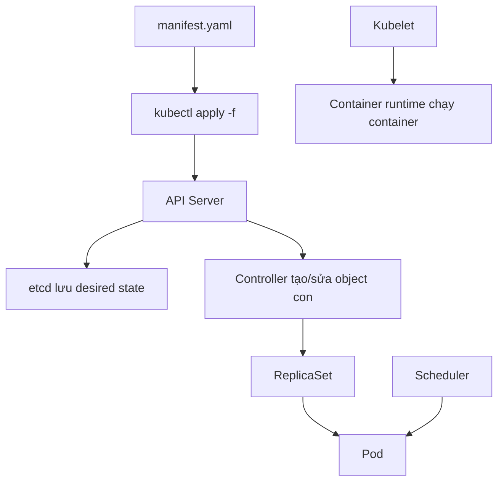

# Chương 00: Cách viết YAML, tổ chức manifest và best practices cho Kubernetes

## Mục tiêu

Chương này dành cho người mới chưa quen viết file `.yaml` trong Kubernetes. Sau khi học xong, bạn cần hiểu được YAML là gì, vì sao Kubernetes dùng YAML, một file manifest Kubernetes gồm những phần nào, cách đọc lỗi indentation, cách tổ chức nhiều file manifest trong một thư mục, cách đặt tên, cách dùng labels/annotations, và cách kiểm tra trước khi apply lên cluster.

Mục tiêu không phải là biến bạn thành chuyên gia YAML. Mục tiêu thực tế hơn: bạn có thể mở một file Kubernetes bất kỳ, hiểu object đó là gì, chỉnh đúng field cần chỉnh, không phá indentation, biết kiểm tra lỗi bằng `kubectl`, và tổ chức thư mục manifest đủ sạch để người khác có thể đọc, apply, debug và bảo trì.

Nếu bạn học CKAD, chương này rất quan trọng. Bài thi CKAD không chỉ hỏi khái niệm Kubernetes; phần lớn thời gian bạn sẽ viết hoặc sửa YAML trong terminal. Người làm nhanh thường không phải người nhớ hết mọi field, mà là người biết cấu trúc manifest, biết sinh YAML bằng `--dry-run=client -o yaml`, biết dùng `kubectl explain`, và biết kiểm tra đúng lỗi.

## YAML là gì?

YAML là một định dạng dữ liệu dùng indentation để biểu diễn cấu trúc. Kubernetes nhận manifest YAML rồi chuyển thành object lưu trong API server. Bạn có thể dùng JSON, nhưng YAML dễ đọc hơn nên được dùng phổ biến cho manifest.

YAML có ba kiểu dữ liệu bạn gặp nhiều nhất:

* Scalar: giá trị đơn như chuỗi, số, boolean.
* Mapping: cặp key/value, giống object hoặc dictionary.
* List: danh sách nhiều phần tử, bắt đầu bằng dấu `-`.

Ví dụ đơn giản:

```yaml
name: web
replicas: 3
enabled: true
ports:
  - 80
  - 443
labels:
  app: web
  env: dev
```

Trong ví dụ trên:

* `name`, `replicas`, `enabled`, `ports`, `labels` là key.
* `web`, `3`, `true` là value.
* `ports` là list.
* `labels` là mapping lồng bên trong mapping.

## Quy tắc YAML cần nhớ

### 1. Indentation cực kỳ quan trọng

YAML không dùng `{}` để xác định block như JSON. Nó dùng khoảng trắng đầu dòng. Vì vậy sai indentation là lỗi phổ biến nhất.

Đúng:

```yaml
metadata:
  name: web
  labels:
    app: web
```

Sai:

```text
metadata:
name: web
labels:
app: web
```

Trong Kubernetes, nên dùng 2 spaces cho mỗi cấp indentation. Không dùng tab.

### 2. List dùng dấu gạch ngang

Ví dụ list container:

```yaml
containers:
  - name: nginx
    image: nginx:1.27-alpine
  - name: sidecar
    image: busybox:1.36
```

Mỗi item trong list bắt đầu bằng `-`. Các field thuộc cùng item phải thụt vào cùng cấp.

Sai rất thường gặp:

```text
containers:
  - name: nginx
  image: nginx:1.27-alpine
```

Ở ví dụ sai, `image` không còn nằm trong container item.

### 3. String, number và boolean

YAML có thể tự hiểu kiểu dữ liệu. Điều này tiện nhưng đôi khi nguy hiểm.

Ví dụ:

```yaml
env:
  - name: ENABLE_CACHE
    value: "true"
  - name: APP_PORT
    value: "8080"
```

Trong Kubernetes `env.value` phải là string, nên nên quote `"true"` và `"8080"`. Nếu viết `value: true`, YAML hiểu là boolean, có thể gây lỗi schema.

### 4. Một file có thể chứa nhiều object

Dùng `---` để tách nhiều document YAML trong cùng file:

```yaml
apiVersion: v1
kind: ConfigMap
metadata:
  name: app-config
data:
  APP_ENV: dev
---
apiVersion: v1
kind: Service
metadata:
  name: web
spec:
  selector:
    app: web
  ports:
    - port: 80
      targetPort: 80
```

Cách này tiện cho lab nhỏ. Với dự án lớn, nên tách file theo nhóm để dễ review.

## Cấu trúc manifest Kubernetes

Hầu hết manifest Kubernetes có bốn phần chính:

```yaml
apiVersion: apps/v1
kind: Deployment
metadata:
  name: web
  labels:
    app: web
spec:
  replicas: 3
  selector:
    matchLabels:
      app: web
  template:
    metadata:
      labels:
        app: web
    spec:
      containers:
        - name: nginx
          image: nginx:1.27-alpine
```

### `apiVersion`

`apiVersion` cho Kubernetes biết object thuộc API group và version nào.

Ví dụ:

* `v1`: Pod, Service, ConfigMap, Secret, Namespace, PVC.
* `apps/v1`: Deployment, ReplicaSet, StatefulSet, DaemonSet.
* `networking.k8s.io/v1`: Ingress, NetworkPolicy.
* `autoscaling/v2`: HorizontalPodAutoscaler.
* `policy/v1`: PodDisruptionBudget.

Nếu dùng API cũ như `extensions/v1beta1` cho Ingress, cluster mới có thể từ chối.

### `kind`

`kind` là loại object bạn muốn tạo:

```yaml
kind: Deployment
```

Kubernetes phân biệt rõ `Pod`, `Deployment`, `Service`, `ConfigMap`, `Secret`. Bạn cần hiểu object nào giải quyết việc gì:

* `Pod`: đơn vị chạy container.
* `Deployment`: quản lý replica và rollout cho Pod stateless.
* `Service`: tạo endpoint ổn định để truy cập Pod.
* `ConfigMap`: chứa cấu hình không nhạy cảm.
* `Secret`: chứa dữ liệu nhạy cảm.
* `PVC`: yêu cầu storage.
* `Ingress`: định tuyến HTTP từ bên ngoài vào Service.

### `metadata`

`metadata` chứa thông tin nhận diện object:

```yaml
metadata:
  name: web
  namespace: demo
  labels:
    app: web
    env: dev
  annotations:
    owner: platform-team
```

Các field quan trọng:

* `name`: tên object trong namespace.
* `namespace`: namespace chứa object.
* `labels`: key/value để chọn, lọc, gom nhóm object.
* `annotations`: metadata phụ, thường dùng cho tool/controller.

Không nên đặt `namespace` trong mọi file nếu bạn muốn apply linh hoạt qua `-n`. Nhưng trong lab, ghi namespace rõ ràng cũng giúp tránh apply nhầm.

### `spec`

`spec` là trạng thái mong muốn. Đây là phần bạn chỉnh nhiều nhất.

Ví dụ với Deployment:

```yaml
spec:
  replicas: 3
  selector:
    matchLabels:
      app: web
  template:
    metadata:
      labels:
        app: web
    spec:
      containers:
        - name: nginx
          image: nginx:1.27-alpine
```

`spec` của mỗi kind khác nhau. `spec` của Service không giống `spec` của Deployment. Vì vậy đừng đoán field. Hãy dùng:

```bash
kubectl explain deployment.spec
kubectl explain deployment.spec.template.spec.containers
kubectl explain service.spec.ports
```

## Diagram: từ YAML tới Pod đang chạy



Điểm quan trọng: `kubectl apply` thành công không có nghĩa container đã chạy đúng. Nó chỉ nói API server đã nhận object. Sau đó scheduler, controller, kubelet và container runtime mới xử lý phần còn lại.

## Ví dụ manifest hoàn chỉnh

Ví dụ sau tạo namespace, ConfigMap, Deployment và Service. Bạn có thể lưu vào file `web-demo.yaml`.

```yaml
apiVersion: v1
kind: Namespace
metadata:
  name: yaml-demo
---
apiVersion: v1
kind: ConfigMap
metadata:
  name: web-config
  namespace: yaml-demo
data:
  APP_ENV: training
  LOG_LEVEL: info
---
apiVersion: apps/v1
kind: Deployment
metadata:
  name: web
  namespace: yaml-demo
  labels:
    app: web
spec:
  replicas: 2
  selector:
    matchLabels:
      app: web
  strategy:
    type: RollingUpdate
    rollingUpdate:
      maxSurge: 1
      maxUnavailable: 0
  template:
    metadata:
      labels:
        app: web
    spec:
      containers:
        - name: nginx
          image: nginx:1.27-alpine
          ports:
            - containerPort: 80
          envFrom:
            - configMapRef:
                name: web-config
          resources:
            requests:
              cpu: 100m
              memory: 128Mi
            limits:
              cpu: 500m
              memory: 256Mi
          readinessProbe:
            httpGet:
              path: /
              port: 80
            periodSeconds: 5
          livenessProbe:
            httpGet:
              path: /
              port: 80
            initialDelaySeconds: 10
            periodSeconds: 10
---
apiVersion: v1
kind: Service
metadata:
  name: web
  namespace: yaml-demo
spec:
  type: ClusterIP
  selector:
    app: web
  ports:
    - name: http
      port: 80
      targetPort: 80
```

Apply:

```bash
kubectl apply -f web-demo.yaml
```

Kiểm tra:

```bash
kubectl get all -n yaml-demo
kubectl rollout status deployment/web -n yaml-demo
kubectl get endpointslice -n yaml-demo -l kubernetes.io/service-name=web
```

Dọn dẹp:

```bash
kubectl delete namespace yaml-demo
```

## Cách đọc một file YAML từ trên xuống

Khi mở một manifest lạ, đọc theo thứ tự sau:

1. `kind`: object này là gì?
2. `metadata.name`: tên object là gì?
3. `metadata.namespace`: nằm ở namespace nào?
4. `metadata.labels`: object được nhận diện bằng label nào?
5. `spec`: trạng thái mong muốn là gì?
6. Nếu là Deployment, kiểm tra `spec.selector.matchLabels` có khớp `spec.template.metadata.labels` không.
7. Nếu là Service, kiểm tra `spec.selector` có khớp label Pod không.
8. Nếu có volume, kiểm tra `volumes` và `volumeMounts` có cùng `name` không.
9. Nếu có ConfigMap/Secret, kiểm tra object đó có tồn tại cùng namespace không.
10. Nếu có probes, kiểm tra path và port có đúng ứng dụng không.

## Tổ chức thư mục manifest

### Cách đơn giản cho lab nhỏ

Với lab nhỏ, bạn có thể dùng:

```text
my-lab/
  namespace.yaml
  configmap.yaml
  secret.yaml
  deployment.yaml
  service.yaml
```

Apply:

```bash
kubectl apply -f my-lab/
```

Kubernetes sẽ đọc tất cả file YAML trong thư mục. Tuy nhiên thứ tự apply đôi khi quan trọng với namespace hoặc CRD. Với tài nguyên cơ bản, bạn nên apply namespace trước nếu namespace chưa tồn tại:

```bash
kubectl apply -f my-lab/namespace.yaml
kubectl apply -f my-lab/
```

### Cách tổ chức rõ hơn cho ứng dụng thật

```text
orders-api/
  README.md
  00-namespace.yaml
  01-configmap.yaml
  02-secret.yaml
  03-storage.yaml
  04-deployment.yaml
  05-service.yaml
  06-ingress.yaml
  07-networkpolicy.yaml
  08-hpa.yaml
  09-pdb.yaml
```

Ưu điểm:

* Người đọc biết apply theo thứ tự nào.
* Review pull request dễ hơn.
* Mỗi file có trách nhiệm rõ.
* Khi lỗi Service, bạn mở `05-service.yaml`; khi lỗi HPA, mở `08-hpa.yaml`.

### Khi nào tách file?

Nên tách file khi:

* Object dài hơn 50-80 dòng.
* Object thuộc nhóm trách nhiệm khác nhau.
* Secret/ConfigMap cần quản lý riêng.
* Team muốn review thay đổi rõ ràng.

Có thể gom file khi:

* Lab ngắn.
* Một bài CKAD cần làm nhanh.
* ConfigMap, Deployment, Service chỉ phục vụ một ví dụ nhỏ.

## Naming conventions

Tên object nên ngắn, rõ nghĩa, dùng lowercase và dấu gạch ngang:

Đúng:

```text
orders-api
web-frontend
payment-worker
api-config
orders-cache
```

Không nên:

```text
OrdersAPI
web_frontend
test123
my-deployment-final-final
```

Tên tốt giúp `kubectl get` dễ đọc và giảm nhầm lẫn khi debug.

## Labels và selector

Labels là nền tảng để Service, Deployment, NetworkPolicy, HPA hoặc command selector hoạt động.

Ví dụ label tốt:

```yaml
labels:
  app: orders-api
  component: api
  tier: backend
  env: dev
```

Service dùng selector:

```yaml
selector:
  app: orders-api
```

Deployment selector phải khớp template label:

```yaml
selector:
  matchLabels:
    app: orders-api
template:
  metadata:
    labels:
      app: orders-api
```

Lỗi phổ biến:

```yaml
selector:
  matchLabels:
    app: orders-api
template:
  metadata:
    labels:
      app: order-api
```

Chỉ thiếu chữ `s` nhưng Deployment hoặc Service có thể không hoạt động đúng.

## Annotations dùng khi nào?

Annotations cũng là key/value nhưng không dùng để select object. Chúng thường chứa metadata phụ:

```yaml
annotations:
  owner: platform-team
  description: "Demo workload for YAML training"
```

Dùng labels cho việc chọn/lọc. Dùng annotations cho thông tin mô tả hoặc cấu hình tool.

## Best practices khi viết manifest

### 1. Luôn dùng image tag cụ thể

Không nên:

```yaml
image: nginx:latest
```

Nên:

```yaml
image: nginx:1.27-alpine
```

Tag cụ thể giúp kết quả deploy lặp lại được.

### 2. Luôn đặt resources cho workload quan trọng

```yaml
resources:
  requests:
    cpu: 100m
    memory: 128Mi
  limits:
    cpu: 500m
    memory: 256Mi
```

Requests giúp scheduler chọn node. Limits giúp giới hạn tài nguyên container.

### 3. Luôn thêm readinessProbe cho app nhận traffic

Readiness quyết định Pod có được đưa vào Service endpoint hay không.

```yaml
readinessProbe:
  httpGet:
    path: /
    port: 80
  periodSeconds: 5
```

Nếu app chưa sẵn sàng, Service không nên gửi traffic tới Pod đó.

### 4. Không lưu secret plain text trong Git thật

Trong lab, bạn có thể dùng `stringData` để học:

```yaml
stringData:
  API_KEY: dev-key
```

Trong môi trường thật, nên dùng giải pháp như External Secrets, Sealed Secrets, SOPS hoặc secret manager của cloud provider.

### 5. Không dùng Pod trực tiếp cho app production

Pod trực tiếp phù hợp để học hoặc debug. Ứng dụng stateless nên dùng Deployment để có rollout, self-healing và scale.

### 6. Verify sau khi apply

Sau khi apply, luôn kiểm tra:

```bash
kubectl get all -n <namespace>
kubectl describe pod <pod> -n <namespace>
kubectl rollout status deployment/<name> -n <namespace>
kubectl get endpointslice -n <namespace>
```

`created` hoặc `configured` chưa đủ để kết luận hệ thống chạy đúng.

## Command quan trọng

### Sinh YAML nhanh

```bash
kubectl create deployment web --image=nginx:1.27-alpine --dry-run=client -o yaml > deployment.yaml
```

Giải thích:

* `kubectl`: CLI làm việc với Kubernetes API.
* `create deployment`: sinh object Deployment.
* `web`: tên Deployment.
* `--image=nginx:1.27-alpine`: image container.
* `--dry-run=client`: không gửi lên cluster, chỉ sinh kết quả phía client.
* `-o yaml`: xuất định dạng YAML.
* `> deployment.yaml`: ghi output ra file.

### Kiểm tra schema field

```bash
kubectl explain deployment.spec.template.spec.containers
```

Giải thích:

* `explain`: xem tài liệu schema ngay trong terminal.
* `deployment.spec.template.spec.containers`: đường dẫn field cần tra.

### Apply manifest

```bash
kubectl apply -f deployment.yaml
```

`apply` tạo object nếu chưa tồn tại, hoặc cập nhật nếu đã tồn tại.

### Validate phía server

```bash
kubectl apply -f deployment.yaml --dry-run=server
```

Lệnh này gửi manifest tới API server để kiểm tra schema/admission nhưng không lưu object. Đây là cách kiểm tra tốt hơn `--dry-run=client` khi cluster có policy hoặc API version cụ thể.

### Xem YAML object đang chạy

```bash
kubectl get deployment web -o yaml
```

Lệnh này giúp bạn so sánh desired manifest của mình với object thực tế trong cluster.

## Quy trình viết manifest an toàn

Làm theo quy trình này khi mới học:

1. Xác định object cần tạo.
2. Sinh khung YAML bằng `kubectl create ... --dry-run=client -o yaml` nếu có thể.
3. Mở file và chỉnh field cần thiết.
4. Dùng `kubectl explain` để kiểm tra field chưa chắc.
5. Apply bằng `kubectl apply -f`.
6. Kiểm tra bằng `kubectl get`.
7. Debug bằng `kubectl describe`, `kubectl logs`, `kubectl get events`.
8. Nếu sai, sửa file YAML rồi apply lại.
9. Khi xong, dọn dẹp bằng `kubectl delete -f`.

Không nên sửa lung tung trực tiếp trên cluster bằng `kubectl edit` khi đang học, vì bạn dễ mất dấu thay đổi. Hãy để file YAML là nguồn chính.

## Các lỗi thường gặp

### Sai indentation

Triệu chứng:

```text
error: error parsing file.yaml: error converting YAML to JSON
```

Cách xử lý:

* Kiểm tra dòng được báo lỗi.
* Kiểm tra list `-` có đúng cấp không.
* Kiểm tra field con có thụt vào đúng 2 spaces không.

### Sai apiVersion

Triệu chứng:

```text
no matches for kind "Ingress" in version "extensions/v1beta1"
```

Cách xử lý:

* Tra API version hiện hành.
* Dùng `kubectl api-resources | findstr Ingress` trên PowerShell.

### Selector không khớp label

Triệu chứng:

* Service không có endpoint.
* Deployment không quản lý Pod đúng.

Kiểm tra:

```bash
kubectl get pods --show-labels
kubectl describe service <service-name>
kubectl get endpointslice -l kubernetes.io/service-name=<service-name>
```

### Secret hoặc ConfigMap không tồn tại

Triệu chứng:

* Pod không start.
* Event báo `configmap not found` hoặc `secret not found`.

Kiểm tra:

```bash
kubectl get cm,secret -n <namespace>
kubectl describe pod <pod> -n <namespace>
```

## Bài tập thực hành

Tạo thư mục:

```text
yaml-practice/
```

Trong đó tạo các file:

```text
00-namespace.yaml
01-configmap.yaml
02-deployment.yaml
03-service.yaml
```

Yêu cầu:

* Namespace tên `yaml-practice`.
* ConfigMap tên `app-config` có `APP_ENV=practice`.
* Deployment tên `web` dùng `nginx:1.27-alpine`, 2 replicas, label `app=web`.
* Container có request/limit CPU/memory.
* Container có readinessProbe.
* Service tên `web`, ClusterIP, port 80.
* Apply lại từ đầu được bằng manifest.
* Test được DNS bằng Pod busybox.

Gợi ý test:

```bash
kubectl run test --image=busybox:1.36 --rm -it --restart=Never -n yaml-practice -- wget -qO- http://web
```

## Checklist tự đánh giá

* [ ] Tôi hiểu `apiVersion`, `kind`, `metadata`, `spec`.
* [ ] Tôi biết mapping và list trong YAML khác nhau thế nào.
* [ ] Tôi không dùng tab để indent YAML.
* [ ] Tôi biết Deployment selector phải khớp Pod template labels.
* [ ] Tôi biết Service selector phải khớp Pod labels.
* [ ] Tôi biết dùng `kubectl explain`.
* [ ] Tôi biết sinh YAML bằng `--dry-run=client -o yaml`.
* [ ] Tôi biết validate bằng `--dry-run=server`.
* [ ] Tôi biết tổ chức manifest thành nhiều file.
* [ ] Tôi biết verify sau khi apply.

## Tóm tắt

Viết YAML Kubernetes tốt là kỹ năng nền tảng. Bạn không cần nhớ toàn bộ field, nhưng phải hiểu cấu trúc object và biết cách kiểm tra. Hãy nhớ bốn phần chính: `apiVersion`, `kind`, `metadata`, `spec`. Hãy dùng labels nhất quán, selector chính xác, image tag cụ thể, resources rõ ràng, probes phù hợp và command verify sau khi apply.

Khi chưa chắc field nào, đừng đoán. Dùng `kubectl explain`. Khi cần tạo nhanh, dùng `--dry-run=client -o yaml`. Khi muốn kiểm tra với API server, dùng `--dry-run=server`. Khi lỗi, đọc `describe` và events trước. Cách làm này giúp bạn học Kubernetes chắc hơn và làm CKAD nhanh hơn.

## Tài liệu tham khảo

* [Kubernetes Object Management](https://kubernetes.io/docs/concepts/overview/working-with-objects/object-management/)
* [Kubernetes Labels and Selectors](https://kubernetes.io/docs/concepts/overview/working-with-objects/labels/)
* [kubectl Cheat Sheet](https://kubernetes.io/docs/reference/kubectl/cheatsheet/)
* [Kubernetes API Reference](https://kubernetes.io/docs/reference/kubernetes-api/)
