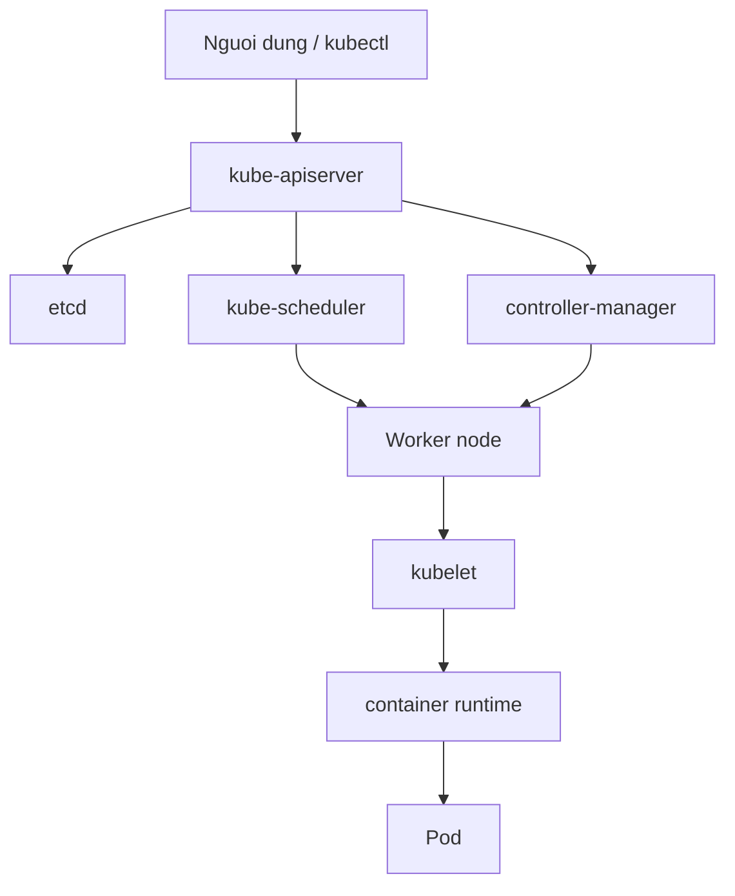

# Bài 1: Giới thiệu Kubernetes và khái niệm Cluster cho CKAD

## Mục tiêu

Sau bài học này, bạn cần nắm được chủ đề chính: Kubernetes là nền tảng điều phối container, cluster, node, pod, control plane và worker node. Bài thuộc nhóm kiến thức **Core Concepts** trong lộ trình CKAD. Mục tiêu không chỉ là nhớ khái niệm mà còn thao tác được bằng `kubectl`, đọc được trạng thái tài nguyên, viết được YAML đầy đủ và biết tự kiểm chứng kết quả.

Khi luyện CKAD, mỗi kiến thức nên được gắn với một hành động cụ thể: tạo tài nguyên, quan sát tài nguyên, sửa lỗi và dọn dẹp. Vì vậy bài này được viết theo hướng thực hành. Bạn sẽ thấy cùng một chủ đề nhưng được nhìn từ ba góc: mô hình hoạt động, manifest YAML và quy trình debug. Cách học hiệu quả là đọc nhanh lý thuyết, tự gõ lại YAML, chạy command, sau đó cố tình tạo lỗi nhỏ để quan sát Kubernetes phản hồi.

## Kiến thức nền tảng

Kubernetes vận hành theo mô hình khai báo. Người dùng gửi trạng thái mong muốn lên API server, các controller và kubelet sẽ cố gắng đưa trạng thái thực tế về gần trạng thái đó. Điểm quan trọng cho người học CKAD là không dừng ở câu hỏi "lệnh này chạy được không", mà phải hỏi tiếp "object nào được tạo", "controller nào chịu trách nhiệm", "Pod đang ở condition nào", và "nếu thất bại thì event nói gì".

Chủ đề của bài này nằm trong domain **Core Concepts**. Trong bài gốc của series DevOps Việt Nam, phần này được đặt ở thứ tự bài 1 và tập trung vào nội dung: Kubernetes là nền tảng điều phối container, cluster, node, pod, control plane và worker node. Tài liệu dưới đây viết lại bằng lời mới, mở rộng thêm các điểm thực tế thường gặp trong cluster hiện đại như `EndpointSlice`, `autoscaling/v2`, `startupProbe`, `metrics-server`, `StorageClass` hoặc workflow `--dry-run=client -o yaml` tùy theo bài.

Một nguyên tắc xuyên suốt: YAML phải mô tả đủ `apiVersion`, `kind`, `metadata` và `spec`. Với CKAD, bạn có thể dùng command imperative để sinh khung YAML nhanh, nhưng kết quả cuối nên được lưu thành file để kiểm tra, sửa và apply lại. Điều này giảm lỗi chính tả, giúp bạn có artefact rõ ràng và dễ rollback khi làm sai.

## Nội dung chi tiết

Kubernetes là nền tảng điều phối container, cluster, node, pod, control plane và worker node.

Trong Kubernetes, mỗi object đều có vai trò riêng. Pod là đơn vị chạy container, Deployment quản lý rollout và replica, Service tạo điểm truy cập ổn định, ConfigMap và Secret đưa cấu hình vào ứng dụng, Volume giải quyết dữ liệu trong filesystem, còn HPA điều chỉnh số Pod theo tải. Người học CKAD cần hiểu quan hệ giữa các object thay vì học từng lệnh rời rạc. Ví dụ, khi Service không truy cập được ứng dụng, lỗi có thể nằm ở selector, port, readiness probe, NetworkPolicy hoặc DNS. Nếu chỉ nhớ `kubectl get svc`, bạn sẽ không đủ dữ kiện để sửa lỗi.

Trạng thái tài nguyên nên được đọc theo lớp. Lớp đầu tiên là `kubectl get`, dùng để biết object có tồn tại và trạng thái tổng quan. Lớp thứ hai là `kubectl describe`, nơi event và condition thường chỉ thẳng nguyên nhân. Lớp thứ ba là `kubectl logs` hoặc `kubectl exec`, dùng khi container đã chạy nhưng hành vi ứng dụng sai. Lớp cuối cùng là manifest YAML: nếu spec sai, cách sửa bền vững là sửa file và apply lại.

Với các cluster Kubernetes hiện đại, bạn cũng nên quen với sự khác biệt giữa API cũ và API hiện hành. Ingress dùng `networking.k8s.io/v1`, HPA nên dùng `autoscaling/v2`, Deployment dùng `apps/v1`, NetworkPolicy dùng `networking.k8s.io/v1`. Một số ví dụ cũ trên Internet còn dùng API beta đã bị loại bỏ; khi luyện thi, hãy kiểm tra bằng `kubectl explain` hoặc tài liệu chính thức.

## Diagram



Sơ đồ trên giúp bạn đặt bài học vào luồng vận hành. Khi gặp lỗi, hãy đi theo mũi tên của sơ đồ để xác định điểm cần kiểm tra. Ví dụ, nếu object phụ thuộc vào Pod, hãy kiểm tra Pod trước; nếu traffic không vào được Pod, hãy kiểm tra Service, EndpointSlice, probe và policy; nếu storage không mount được, hãy kiểm tra PVC/PV/StorageClass.

## Command

### `kubectl cluster-info`
Hiển thị địa chỉ control plane và các dịch vụ hệ thống nếu cluster đang sẵn sàng.

Giải thích thành phần:
* `kubectl`: CLI gửi request tới Kubernetes API server.
* `cluster-info`: Đối tượng, tên tài nguyên, image hoặc tham số của command.

### `kubectl get nodes -o wide`
Liệt kê node cùng trạng thái, phiên bản, IP nội bộ và runtime.

Giải thích thành phần:
* `kubectl`: CLI gửi request tới Kubernetes API server.
* `get`: Subcommand xác định hành động cần thực hiện.
* `nodes`: Đối tượng, tên tài nguyên, image hoặc tham số của command.
* `-o`: Flag điều chỉnh phạm vi, output hoặc hành vi của lệnh.
* `wide`: Đối tượng, tên tài nguyên, image hoặc tham số của command.

### `kubectl get pods -A`
Xem pod ở tất cả namespace để nhận diện workload hệ thống và workload ứng dụng.

Giải thích thành phần:
* `kubectl`: CLI gửi request tới Kubernetes API server.
* `get`: Subcommand xác định hành động cần thực hiện.
* `pods`: Đối tượng, tên tài nguyên, image hoặc tham số của command.
* `-A`: Flag điều chỉnh phạm vi, output hoặc hành vi của lệnh.

### `kubectl describe node <node-name>`
Đọc chi tiết capacity, allocatable, condition, taint và event của một node.

Giải thích thành phần:
* `kubectl`: CLI gửi request tới Kubernetes API server.
* `describe`: Subcommand xác định hành động cần thực hiện.
* `node`: Đối tượng, tên tài nguyên, image hoặc tham số của command.
* `<node-name>`: Đối tượng, tên tài nguyên, image hoặc tham số của command.

Khi làm bài thi, bạn nên dùng `kubectl explain` để kiểm tra field thay vì đoán. Ví dụ `kubectl explain pod.spec.containers.resources` hoặc `kubectl explain deployment.spec.strategy` cho biết field nào hợp lệ, kiểu dữ liệu là gì và nằm ở cấp nào. Nếu cần tạo YAML nhanh, dùng `--dry-run=client -o yaml` rồi chỉnh file. Đây là kỹ năng tiết kiệm thời gian nhưng vẫn giữ được tính declarative.

## Ví dụ thực hành

Lưu manifest sau vào file phù hợp, ví dụ `lesson-01.yaml`:

```yaml
apiVersion: v1
kind: Pod
metadata:
  name: hello-kubernetes
  labels:
app: hello
spec:
  containers:
  - name: web
image: nginx:1.27-alpine
ports:
- containerPort: 80
```

Áp dụng manifest:

```bash
kubectl apply -f lesson-01.yaml
```

Kiểm tra:

```bash
kubectl get all
kubectl describe pod --selector app=web
```

Không phải mọi bài đều tạo label `app=web`, nên nếu selector trên không trả dữ liệu, hãy dùng `kubectl get pods` để lấy tên Pod cụ thể rồi chạy `kubectl describe pod <ten-pod>`. Đây cũng là cách luyện phản xạ trong CKAD: command mẫu giúp bắt đầu nhanh, nhưng bạn phải điều chỉnh theo tài nguyên thật.

## Lab

Tạo một Pod nginx đầu tiên, quan sát trạng thái Running, sau đó dùng describe để đọc lịch sử scheduling và image pull.

Các bước gợi ý:

1. Tạo namespace riêng: `kubectl create namespace lesson-01`.
2. Chuyển namespace: `kubectl config set-context --current --namespace=lesson-01`.
3. Apply YAML của bài.
4. Dùng `kubectl get`, `kubectl describe`, `kubectl logs` hoặc `kubectl exec` để verify.
5. Ghi lại lỗi nếu có, sửa manifest, apply lại.
6. Dọn dẹp bằng `kubectl delete -f lesson-01.yaml` và xóa namespace nếu không dùng nữa.

Phần quan trọng nhất của lab là bước verify. Một manifest apply thành công không có nghĩa workload hoạt động đúng. API server chỉ xác nhận object hợp lệ về schema và được lưu; còn image pull, scheduling, readiness, network hay mount volume có thể vẫn thất bại ở runtime.

## Troubleshooting

Quy trình debug nên đi từ rộng tới hẹp:

* `kubectl get pods -o wide`: kiểm tra phase, node, IP và restart count.
* `kubectl describe pod <name>`: đọc Events từ dưới lên vì event mới thường nằm cuối.
* `kubectl logs <pod> -c <container>`: xem stdout/stderr của container.
* `kubectl exec <pod> -c <container> -- <command>`: kiểm tra runtime bên trong container.
* `kubectl get events --sort-by=.metadata.creationTimestamp`: nhìn toàn cảnh sự kiện trong namespace.

Nếu Pod Pending, hãy nghĩ tới scheduler, resource request, taint/toleration, node selector hoặc PVC Pending. Nếu Pod Running nhưng không Ready, hãy kiểm tra readiness probe, port, dependency và log ứng dụng. Nếu Service không có backend, hãy kiểm tra selector và EndpointSlice. Nếu DNS lỗi, hãy kiểm tra CoreDNS và thử FQDN đầy đủ `service.namespace.svc.cluster.local`.

## Common Mistakes

* Nhầm Pod với container đơn lẻ.
* Cho rằng tự tạo Pod trực tiếp là cách triển khai production.
* Không phân biệt desired state và current state.

Một lỗi lớn khác là học thuộc command mà không hiểu scope của command. `kubectl get pods` chỉ xem namespace hiện tại; `kubectl get pods -A` mới xem tất cả namespace. `kubectl logs pod` chỉ lấy container mặc định; Pod nhiều container cần `-c`. `kubectl delete pod` có thể vô ích nếu Pod thuộc Deployment vì ReplicaSet sẽ tạo lại Pod mới. Hãy luôn hỏi object này do ai quản lý.

## Best Practices

* Luôn đặt label có ý nghĩa để Service, NetworkPolicy và truy vấn selector hoạt động ổn định.
* Ưu tiên manifest declarative cho tài nguyên quan trọng; dùng imperative để sinh khung khi cần tốc độ.
* Ghim image tag cụ thể thay vì dùng `latest`, đặc biệt trong lab cần kết quả lặp lại.
* Đặt resource requests cho workload cần autoscaling hoặc cần scheduling dự đoán được.
* Tách cấu hình khỏi image bằng ConfigMap/Secret; không đưa bí mật vào Git dưới dạng plain text.
* Verify sau mỗi thao tác bằng ít nhất một lệnh đọc trạng thái và một lệnh kiểm chứng hành vi.
* Dọn tài nguyên sau lab để tránh nhiễu event, name conflict và tiêu tốn tài nguyên local.

Với CKAD, best practice còn là quản lý thời gian. Nếu một câu bị kẹt quá lâu, hãy lưu file đang làm, đánh dấu lại và chuyển câu khác. Điểm thi đến từ số task hoàn thành đúng, không đến từ việc tối ưu một câu duy nhất.

## Tóm tắt

Bài này giúp bạn nắm nội dung: Kubernetes là nền tảng điều phối container, cluster, node, pod, control plane và worker node. Bạn đã có manifest chạy được, bộ command cần nhớ, quy trình debug và các lỗi hay gặp. Hãy luyện cho tới khi bạn có thể tự tạo YAML từ trí nhớ ở mức khung chính, sau đó dùng `kubectl explain` để tra field chi tiết. Khi đọc tài liệu Kubernetes, hãy ưu tiên phiên bản API hiện hành và tránh ví dụ đã lỗi thời.

Điều cần nhớ cho CKAD: Kubernetes là bài thi thực hành. Bạn không cần viết văn giải thích dài trong phòng thi, nhưng cần tạo đúng object, đúng namespace, đúng spec và verify được trạng thái. Nếu bạn hiểu vì sao một object hoạt động, command chỉ còn là công cụ.

## Câu hỏi ôn tập

1. Object chính của bài này giải quyết vấn đề gì trong Kubernetes?
2. Command nào dùng để xem trạng thái tổng quan? Command nào dùng để đọc nguyên nhân lỗi?
3. Nếu manifest apply thành công nhưng workload không hoạt động, bạn sẽ kiểm tra theo thứ tự nào?
4. Field YAML nào dễ viết sai nhất trong bài này?
5. Trong CKAD, bạn sẽ dùng imperative command nào để sinh YAML nhanh cho chủ đề này?
6. Làm sao xác nhận tài nguyên đã chạy đúng chứ không chỉ tồn tại trong API server?

## Tài liệu tham khảo

* [Kubernetes Documentation](https://kubernetes.io/docs/)
* [kubectl Quick Reference](https://kubernetes.io/docs/reference/kubectl/quick-reference/)
* [Kubernetes API Reference](https://kubernetes.io/docs/reference/kubernetes-api/)
* [CKAD Certification](https://www.cncf.io/training/certification/ckad/)
* [Series DevOps Việt Nam: Kubernetes từ cơ bản đến CKAD](https://devops.vn/posts/lo-trinh-hoc-kubernetes-tu-co-ban-den-chung-chi-ckad/)
