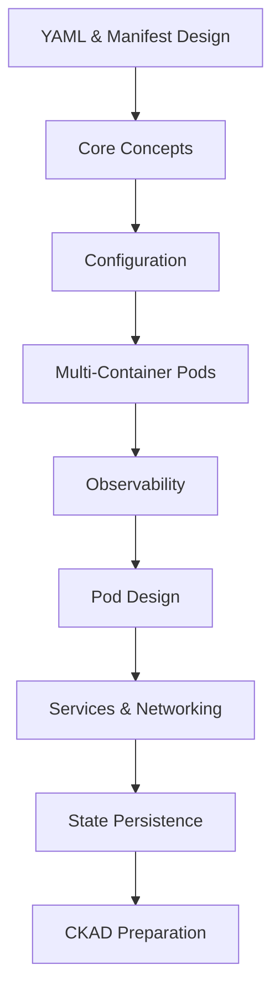

# Giáo trình Kubernetes từ cơ bản đến CKAD

Bộ tài liệu này được xây dựng lại từ lộ trình 20 bài Kubernetes của DevOps Việt Nam, viết lại hoàn toàn bằng tiếng Việt theo hướng giáo trình thực hành. Nội dung được mở rộng bằng kiến thức từ Kubernetes Documentation chính thức và kinh nghiệm luyện CKAD: dùng YAML hiện hành, command hợp lệ, workflow debug rõ ràng và bài lab có thể chạy trên Minikube hoặc cluster tương thích.

## Lộ trình học

Học chương 00 trước để nắm cách viết YAML, cấu trúc manifest và best practices tổ chức file. Sau đó học theo thứ tự từ 01 tới 20. Các bài đầu tạo nền móng về Pod, cluster và kubectl. Nhóm giữa tập trung vào cấu hình, multi-container Pod, observability và thiết kế Pod. Nhóm cuối xử lý networking, storage và chiến thuật thi CKAD.

| Thứ tự | Bài học | Domain | Trọng tâm |
|---:|---|---|---|
| 0 | [Cách viết YAML, tổ chức manifest và best practices](./00-yaml-manifest-best-practices/README.md) | YAML & Manifest Design | Học cách viết file YAML, cấu trúc manifest Kubernetes, tổ chức thư mục, labels/selectors và quy trình validate/apply/debug. |
| 1 | [Giới thiệu Kubernetes và khái niệm Cluster cho CKAD](./01-introduction/README.md) | Core Concepts | Kubernetes là nền tảng điều phối container, cluster, node, pod, control plane và worker node. |
| 2 | [Cài đặt Minikube và sử dụng kubectl cơ bản](./02-installation/README.md) | Core Concepts | Thiết lập cluster local bằng Minikube, cấu hình kubectl, context, namespace và thao tác CRUD cơ bản. |
| 3 | [Quản lý Pod cơ bản: create, delete, describe](./03-pods/README.md) | Core Concepts | Tạo Pod bằng lệnh và YAML, đọc phase, condition, restart count, event và xóa tài nguyên đúng cách. |
| 4 | [Sử dụng ConfigMap và Secret trong YAML](./04-configmap-secret/README.md) | Configuration | Tách cấu hình khỏi image, dùng ConfigMap cho dữ liệu không nhạy cảm và Secret cho dữ liệu nhạy cảm. |
| 5 | [Quản lý Environment Variables và Command/Args](./05-env-command-args/README.md) | Configuration | Inject biến môi trường, dùng downward API, override ENTRYPOINT/CMD bằng command và args. |
| 6 | [Cấu hình Deployment và ReplicaSet](./06-deployment-replicaset/README.md) | Configuration | Quản lý ứng dụng stateless bằng Deployment, ReplicaSet, rollout, rollback và selector bất biến. |
| 7 | [Thiết kế Pod với nhiều Container](./07-multi-container-pods/README.md) | Multi-Container Pods | Hiểu khi nào nhiều container nên cùng ở một Pod: cùng lifecycle, network namespace và volume. |
| 8 | [Sử dụng Sidecar và Init Container](./08-sidecar-init-container/README.md) | Multi-Container Pods | Init container chạy trước container chính; sidecar chạy cùng để bổ trợ logging, proxy, sync hoặc config rendering. |
| 9 | [Chia sẻ tài nguyên giữa các Container](./09-shared-resources/README.md) | Multi-Container Pods | Chia sẻ network namespace, localhost, volume và tài nguyên CPU/memory giữa container trong Pod. |
| 10 | [Giám sát Log và Events với kubectl logs](./10-logs-events/README.md) | Observability | Truy xuất stdout/stderr, log container trước khi restart, event theo thời gian và workflow debug CrashLoopBackOff. |
| 11 | [Debug Pod với kubectl describe và exec](./11-debug-describe-exec/README.md) | Observability | Quy trình debug từ get, describe, logs, exec, events tới ephemeral debug container khi cần. |
| 12 | [Tối ưu Pod với Resource Limits và Requests](./12-resources/README.md) | Pod Design | Requests phục vụ scheduling; limits giới hạn runtime; QoS class ảnh hưởng eviction khi node thiếu tài nguyên. |
| 13 | [Sử dụng Liveness, Readiness và Startup Probes](./13-probes/README.md) | Pod Design | Health check bằng HTTP, TCP, exec, gRPC; liveness restart, readiness điều khiển endpoint, startup bảo vệ app khởi động chậm. |
| 14 | [Tối ưu hóa Pod với HPA](./14-hpa/README.md) | Pod Design | Horizontal Pod Autoscaler scale Deployment theo metrics, thường là CPU utilization, cần metrics-server và resource requests. |
| 15 | [Cấu hình Service: ClusterIP và NodePort](./15-services/README.md) | Services & Networking | Service chọn Pod bằng selector, tạo virtual IP ổn định và chuyển traffic tới EndpointSlice. |
| 16 | [Sử dụng Ingress và NetworkPolicy](./16-ingress-networkpolicy/README.md) | Services & Networking | Ingress định tuyến HTTP/HTTPS layer 7; NetworkPolicy kiểm soát traffic vào/ra Pod khi CNI hỗ trợ. |
| 17 | [Quản lý DNS và Load Balancing trong Kubernetes](./17-dns-loadbalancing/README.md) | Services & Networking | CoreDNS tạo record cho Service; kube-proxy/eBPF dataplane phân phối traffic tới endpoints. |
| 18 | [Sử dụng Volume: emptyDir và hostPath](./18-volumes/README.md) | State Persistence | Volume gắn vào Pod để chia sẻ dữ liệu; emptyDir sống theo Pod; hostPath phụ thuộc node và cần dùng rất cẩn trọng. |
| 19 | [Cấu hình PersistentVolume và PersistentVolumeClaim](./19-pv-pvc/README.md) | State Persistence | PV đại diện storage trong cluster; PVC là yêu cầu storage của workload; StorageClass hỗ trợ dynamic provisioning. |
| 20 | [Tổng kết, mẹo thi CKAD và bài tập thực hành cuối](./20-ckad-preparation/README.md) | CKAD Preparation | Ôn toàn bộ domain CKAD, chiến thuật dùng kubectl nhanh, quản lý thời gian và bài lab tổng hợp. |

## Sơ đồ kiến thức



## Thứ tự học

1. Đọc chương 00 để nắm YAML, manifest structure và cách tổ chức file.
2. Đọc mục Mục tiêu và Kiến thức nền tảng của từng bài.
3. Gõ lại YAML, không chỉ copy.
4. Apply vào namespace riêng.
5. Verify bằng `kubectl get`, `describe`, `logs`, `exec`.
6. Cố tình tạo một lỗi nhỏ để luyện troubleshooting.
7. Dọn dẹp tài nguyên trước khi sang bài tiếp theo.

## Checklist hoàn thành

- [ ] Chương 00: [Cách viết YAML, tổ chức manifest và best practices](./00-yaml-manifest-best-practices/README.md)
- [ ] Bài 01: [Giới thiệu Kubernetes và khái niệm Cluster cho CKAD](./01-introduction/README.md)
- [ ] Bài 02: [Cài đặt Minikube và sử dụng kubectl cơ bản](./02-installation/README.md)
- [ ] Bài 03: [Quản lý Pod cơ bản: create, delete, describe](./03-pods/README.md)
- [ ] Bài 04: [Sử dụng ConfigMap và Secret trong YAML](./04-configmap-secret/README.md)
- [ ] Bài 05: [Quản lý Environment Variables và Command/Args](./05-env-command-args/README.md)
- [ ] Bài 06: [Cấu hình Deployment và ReplicaSet](./06-deployment-replicaset/README.md)
- [ ] Bài 07: [Thiết kế Pod với nhiều Container](./07-multi-container-pods/README.md)
- [ ] Bài 08: [Sử dụng Sidecar và Init Container](./08-sidecar-init-container/README.md)
- [ ] Bài 09: [Chia sẻ tài nguyên giữa các Container](./09-shared-resources/README.md)
- [ ] Bài 10: [Giám sát Log và Events với kubectl logs](./10-logs-events/README.md)
- [ ] Bài 11: [Debug Pod với kubectl describe và exec](./11-debug-describe-exec/README.md)
- [ ] Bài 12: [Tối ưu Pod với Resource Limits và Requests](./12-resources/README.md)
- [ ] Bài 13: [Sử dụng Liveness, Readiness và Startup Probes](./13-probes/README.md)
- [ ] Bài 14: [Tối ưu hóa Pod với HPA](./14-hpa/README.md)
- [ ] Bài 15: [Cấu hình Service: ClusterIP và NodePort](./15-services/README.md)
- [ ] Bài 16: [Sử dụng Ingress và NetworkPolicy](./16-ingress-networkpolicy/README.md)
- [ ] Bài 17: [Quản lý DNS và Load Balancing trong Kubernetes](./17-dns-loadbalancing/README.md)
- [ ] Bài 18: [Sử dụng Volume: emptyDir và hostPath](./18-volumes/README.md)
- [ ] Bài 19: [Cấu hình PersistentVolume và PersistentVolumeClaim](./19-pv-pvc/README.md)
- [ ] Bài 20: [Tổng kết, mẹo thi CKAD và bài tập thực hành cuối](./20-ckad-preparation/README.md)
## Hướng dẫn luyện CKAD

Luyện CKAD cần tốc độ và độ chính xác. Hãy cấu hình alias `k=kubectl`, bật completion nếu môi trường cho phép, dùng `--dry-run=client -o yaml` để sinh manifest, và luôn kiểm tra namespace trước khi làm bài. Với mỗi task, hãy đọc yêu cầu, tạo file YAML, apply, verify, rồi chuyển câu. Đừng dành quá lâu cho một lỗi nếu bạn có thể quay lại sau.

Cách luyện tốt nhất là chia mỗi buổi thành ba pha. Pha một là tái hiện: tạo lại object từ bài học mà không nhìn đáp án, chỉ dùng `kubectl explain` khi bí field. Pha hai là phá lỗi có kiểm soát: đổi sai image, selector, port, probe path, request CPU hoặc claimName để xem Kubernetes báo lỗi ở đâu. Pha ba là sửa lỗi: không xóa sạch làm lại ngay, mà đọc event, log, YAML hiện tại rồi chỉnh đúng nguyên nhân. Ba pha này biến kiến thức rời rạc thành phản xạ vận hành.

Trong lúc thi, hãy tạo thư mục làm việc như `/tmp/ckad` nếu môi trường cho phép và lưu từng câu thành file riêng: `q1.yaml`, `q2.yaml`. Cách này giúp bạn quay lại câu cũ nhanh, tránh mất nội dung khi terminal bị cuộn, và có thể dùng `kubectl diff -f q1.yaml` nếu cluster hỗ trợ. Đừng phụ thuộc vào editor phức tạp; `vi`, `nano` hoặc editor mặc định đều đủ nếu bạn luyện trước.

Một chiến thuật quan trọng là nhận diện dạng câu. Nếu đề yêu cầu tạo Pod đơn giản, dùng `kubectl run --dry-run=client -o yaml`. Nếu đề yêu cầu Deployment, dùng `kubectl create deployment`. Nếu đề yêu cầu Service, dùng `kubectl expose` hoặc viết YAML ngắn. Nếu đề yêu cầu ConfigMap/Secret, imperative command thường nhanh và ít lỗi hơn, sau đó dùng `kubectl get -o yaml` để kiểm tra. Với NetworkPolicy, Ingress, probes, resources và PV/PVC, viết YAML cẩn thận thường an toàn hơn vì nhiều field nằm sâu trong spec.

Khi verify, đừng chỉ nhìn một dòng `created` hoặc `configured`. Hãy kiểm tra object đã được controller xử lý xong chưa. Deployment cần `rollout status`; Service cần endpoints; Pod cần Ready; HPA cần current metrics; PVC cần Bound; Ingress cần controller và backend; NetworkPolicy cần test từ Pod được phép và Pod không được phép. Điểm CKAD mất nhiều nhất ở các lỗi "object tồn tại nhưng hành vi sai".

Bạn cũng nên luyện với namespace. Nhiều đề thi chỉ định namespace rõ ràng; làm sai namespace gần như mất điểm dù manifest đúng. Trước mỗi câu, chạy `kubectl config set-context --current --namespace=<ns>` hoặc thêm `-n <ns>` nhất quán. Khi kiểm tra, dùng `kubectl get all -n <ns>` để tránh nhìn nhầm tài nguyên ở namespace khác.

Các command nên thuộc phản xạ:

```bash
kubectl get pods -A
kubectl describe pod <pod>
kubectl logs <pod> -c <container> --previous
kubectl explain pod.spec.containers
kubectl create deployment web --image=nginx --dry-run=client -o yaml > deploy.yaml
kubectl run test --image=busybox:1.36 --rm -it --restart=Never -- sh
kubectl get events --sort-by=.metadata.creationTimestamp
```

Khi ôn tập, hãy bấm giờ. Một bài nhỏ nên hoàn thành trong 5-8 phút; bài tổng hợp có Deployment, Service, ConfigMap, Secret, probe và volume nên hoàn thành trong 20-30 phút. Kết quả cuối cùng không phải là nhớ mọi field, mà là biết tra đúng chỗ và sửa lỗi nhanh trong terminal.

## Kế hoạch 4 tuần

Tuần 1 tập trung Core Concepts và Configuration. Mục tiêu là tạo Pod, Deployment, ConfigMap, Secret, env, command và args mà không cần nhìn mẫu quá nhiều. Mỗi ngày hãy làm ít nhất 5 lần thao tác: sinh YAML, chỉnh YAML, apply, describe, delete.

Tuần 2 tập trung Multi-Container Pods, Observability và Pod Design. Hãy luyện Pod nhiều container, init container, sidecar, logs với `-c`, logs với `--previous`, resource requests/limits và probes. Đây là nhóm kiến thức dễ mất thời gian vì lỗi nằm ở runtime, không chỉ ở YAML syntax.

Tuần 3 tập trung Services & Networking và State Persistence. Hãy tạo Deployment nhiều replica, expose Service, kiểm tra EndpointSlice, test DNS bằng busybox, tạo Ingress, áp NetworkPolicy, dùng emptyDir và PVC. Sau mỗi lab, tự đặt câu hỏi: nếu client không truy cập được, mình kiểm tra theo thứ tự nào?

Tuần 4 là tuần mô phỏng thi. Trộn các dạng bài, đặt timer 120 phút, không mở tài liệu ngoài trừ tài liệu Kubernetes được phép trong môi trường thi. Sau mỗi buổi, ghi lại command nào gõ chậm, field nào hay sai, và tạo một cheat sheet cá nhân ngắn. Cheat sheet tốt không phải là bản sao tài liệu, mà là danh sách lỗi cá nhân cần tránh.

## Tiêu chí hoàn thành giáo trình

Bạn có thể coi mình hoàn thành giáo trình khi tự làm được các việc sau: tạo Deployment có rolling update và rollback; inject cấu hình bằng ConfigMap/Secret; thiết kế Pod có sidecar/init container; debug CrashLoopBackOff bằng logs/events/describe; cấu hình resources và probes; expose app bằng Service/Ingress; kiểm tra DNS và endpoint; dùng PVC để giữ dữ liệu qua vòng đời Pod; hoàn thành một bài lab tổng hợp trong dưới 30 phút.

## Tài liệu tham khảo

* [Kubernetes Documentation](https://kubernetes.io/docs/)
* [kubectl Quick Reference](https://kubernetes.io/docs/reference/kubectl/quick-reference/)
* [Kubernetes API Reference](https://kubernetes.io/docs/reference/kubernetes-api/)
* [CKAD Certification](https://www.cncf.io/training/certification/ckad/)
* [DevOps Việt Nam Kubernetes CKAD series](https://devops.vn/posts/lo-trinh-hoc-kubernetes-tu-co-ban-den-chung-chi-ckad/)
