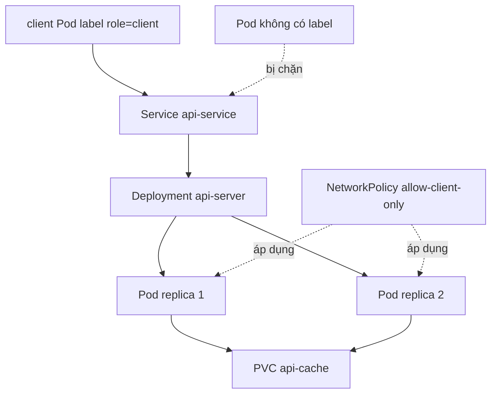

# Lab 02 - Trung bình: Rolling Update, Service Discovery, NetworkPolicy và PVC

## Bối cảnh

Một team backend cần triển khai API stateless nhưng vẫn cần một thư mục cache bền vững để lưu dữ liệu tạm qua vòng đời Pod. Ứng dụng phải được expose nội bộ bằng Service, có rollout an toàn, có thể rollback khi image lỗi, và chỉ cho phép Pod client có label phù hợp truy cập.

Lab này mô phỏng một tình huống khá sát thực tế: ứng dụng chạy nhiều replica, cần Service Discovery, có persistent storage tối thiểu, và phải được bảo vệ bằng `NetworkPolicy`. Bạn sẽ luyện phối hợp `Deployment`, `Service`, `PVC`, `ConfigMap`, `Secret`, `NetworkPolicy`, rollout và rollback.

## Mục tiêu

Bạn cần thực hành được:

* Thiết kế Deployment có rolling update.
* Dùng `PersistentVolumeClaim` với StorageClass mặc định.
* Mount PVC vào container.
* Expose app bằng ClusterIP Service.
* Test DNS nội bộ bằng Pod client.
* Áp dụng NetworkPolicy để giới hạn traffic.
* Thực hiện rollout image mới và rollback khi lỗi.

## Namespace

Toàn bộ tài nguyên phải nằm trong namespace:

```text
lab-medium
```

## Kiến trúc mong muốn



## Tài nguyên cần tạo

| Object | Tên | Yêu cầu chính |
|---|---|---|
| Namespace | `lab-medium` | Tách biệt tài nguyên lab |
| ConfigMap | `api-config` | Chứa cấu hình app |
| Secret | `api-secret` | Chứa API key giả lập |
| PVC | `api-cache` | Request `1Gi`, access mode `ReadWriteOnce` |
| Deployment | `api-server` | 2 replicas, rolling update |
| Service | `api-service` | ClusterIP port `80` |
| NetworkPolicy | `allow-client-only` | Chỉ cho Pod `role=client` truy cập |

## Yêu cầu ConfigMap và Secret

`ConfigMap api-config` cần có:

```text
APP_MODE=medium-lab
CACHE_DIR=/cache
FEATURE_FLAG=true
```

`Secret api-secret` cần có:

```text
API_KEY=medium-secret-key
```

## Yêu cầu PVC

Tạo `PersistentVolumeClaim` tên `api-cache`:

* `accessModes`: `ReadWriteOnce`.
* Request storage: `1Gi`.
* Không hard-code `storageClassName` nếu cluster của bạn đã có default StorageClass.

Nếu PVC bị `Pending`, bạn phải kiểm tra `StorageClass` và ghi lại nguyên nhân.

## Yêu cầu Deployment

Tạo Deployment `api-server`:

* Image ban đầu: `nginx:1.27-alpine`.
* Replicas: `2`.
* Label Pod: `app: api-server`.
* Strategy:
  * `type: RollingUpdate`
  * `maxSurge: 1`
  * `maxUnavailable: 0`
* Mount PVC `api-cache` vào `/cache`.
* Inject config từ `api-config`.
* Inject secret key `API_KEY` từ `api-secret`.
* Có readinessProbe tới `/` port `80`.
* Có livenessProbe tới `/` port `80`.
* Có resource requests/limits hợp lý:
  * requests: `cpu=100m`, `memory=128Mi`
  * limits: `cpu=500m`, `memory=256Mi`

## Yêu cầu Service

Tạo `Service api-service`:

* Type: `ClusterIP`.
* Selector: `app: api-server`.
* Port: `80`.
* TargetPort: `80`.

Sau khi tạo Service, phải kiểm tra có endpoint:

```bash
kubectl get endpointslice -n lab-medium -l kubernetes.io/service-name=api-service
```

## Yêu cầu NetworkPolicy

Tạo `NetworkPolicy allow-client-only`:

* Áp dụng cho Pod có label `app: api-server`.
* Chỉ cho phép ingress TCP port `80`.
* Chỉ cho phép từ Pod có label `role: client` trong cùng namespace.
* Không cần egress policy trong lab này.

## Bài test bắt buộc

### Test 1 - Client được phép

Tạo Pod client có label:

```text
role=client
```

Pod này phải gọi được:

```sh
wget -qO- http://api-service
```

### Test 2 - Client bị chặn

Tạo Pod khác không có label `role=client`. Pod này không được truy cập `api-service` nếu CNI của cluster enforce NetworkPolicy.

Nếu bạn dùng Minikube với CNI không enforce NetworkPolicy, hãy ghi rõ kết quả quan sát và giải thích vì sao policy không có tác dụng.

### Test 3 - Rollout thành công

Cập nhật image Deployment từ:

```text
nginx:1.27-alpine
```

sang:

```text
nginx:1.26-alpine
```

Theo dõi:

```bash
kubectl rollout status deployment/api-server -n lab-medium
kubectl rollout history deployment/api-server -n lab-medium
```

### Test 4 - Rollout lỗi và rollback

Cập nhật image sang tag sai:

```text
nginx:not-a-real-tag
```

Quan sát lỗi bằng:

```bash
kubectl get pods -n lab-medium
kubectl describe pod <pod-loi> -n lab-medium
```

Sau đó rollback:

```bash
kubectl rollout undo deployment/api-server -n lab-medium
```

## Gợi ý

* Nếu Deployment không tạo Pod, kiểm tra selector và template label.
* Nếu Pod Pending, kiểm tra PVC, resource request và event scheduling.
* Nếu Service không có endpoint, kiểm tra readiness probe và label.
* Nếu NetworkPolicy không chặn traffic, kiểm tra CNI có hỗ trợ policy không.
* Nếu rollback không về đúng version mong muốn, dùng `kubectl rollout history`.

## Deliverables

Bạn cần tạo tối thiểu các file YAML sau trong thư mục làm bài của bạn:

```text
namespace.yaml
config-secret.yaml
pvc.yaml
deployment.yaml
service.yaml
networkpolicy.yaml
```

Không bắt buộc đúng tên file, nhưng phải có khả năng apply lại từ đầu.

## Checklist hoàn thành

* [ ] Namespace `lab-medium` tồn tại.
* [ ] PVC `api-cache` ở trạng thái `Bound`.
* [ ] Deployment `api-server` có 2 Pod Ready.
* [ ] Service `api-service` có endpoints.
* [ ] Pod có label `role=client` truy cập được Service.
* [ ] Pod không có label bị chặn hoặc có giải thích nếu CNI không enforce.
* [ ] Rollout image hợp lệ thành công.
* [ ] Rollout image lỗi được rollback thành công.

## Tiêu chí đánh giá

Lab đạt yêu cầu khi bạn có thể chạy:

```bash
kubectl delete namespace lab-medium
kubectl apply -f .
```

và tái tạo được toàn bộ hệ thống, sau đó thực hiện được các bài test nêu trên.

