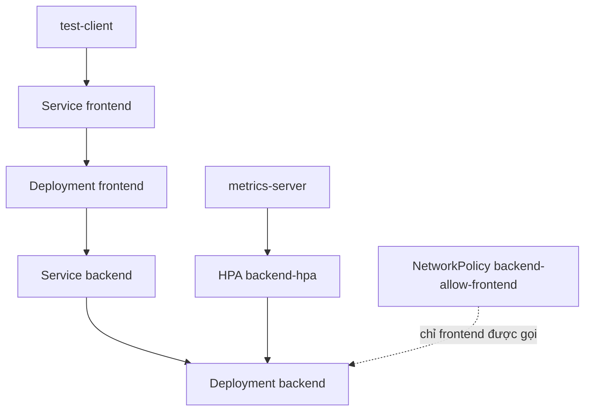

# Lab 03 - Nâng cao: Microservices nội bộ, Observability, HPA và Debug sự cố

## Bối cảnh

Bạn là DevOps Engineer phụ trách một hệ thống gồm hai service nội bộ:

* `frontend`: nhận request từ người dùng nội bộ.
* `backend`: xử lý request và chỉ được frontend gọi.

Hệ thống cần có cấu hình tách biệt, health check, resource requests/limits, Service Discovery, NetworkPolicy, Horizontal Pod Autoscaler và quy trình debug khi một phiên bản backend lỗi. Lab này yêu cầu bạn không chỉ tạo object, mà phải kiểm chứng hành vi giữa nhiều service.

## Mục tiêu

Sau lab này, bạn cần thực hiện được:

* Triển khai nhiều Deployment có quan hệ phụ thuộc.
* Dùng Service DNS để frontend gọi backend.
* Dùng ConfigMap để truyền URL backend.
* Dùng NetworkPolicy để chỉ frontend truy cập backend.
* Cấu hình probes và resources cho từng service.
* Cấu hình HPA cho backend.
* Tạo load test tối thiểu để quan sát autoscaling.
* Debug rollout lỗi và khôi phục hệ thống.

## Namespace

Toàn bộ tài nguyên nằm trong:

```text
lab-advanced
```

## Kiến trúc mong muốn



## Ràng buộc quan trọng

* Không dùng namespace `default`.
* Không dùng image `latest`.
* Không dùng `hostNetwork`.
* Không expose backend ra ngoài bằng NodePort.
* Không bỏ qua readiness/liveness probe.
* Không bỏ qua resource requests nếu cấu hình HPA.

## Tài nguyên cần tạo

| Object | Tên |
|---|---|
| Namespace | `lab-advanced` |
| ConfigMap | `frontend-config` |
| Deployment | `frontend` |
| Service | `frontend` |
| Deployment | `backend` |
| Service | `backend` |
| NetworkPolicy | `backend-allow-frontend` |
| HPA | `backend-hpa` |

## Thiết kế backend

Triển khai Deployment `backend`:

* Image: `registry.k8s.io/hpa-example`.
* Replicas ban đầu: `1`.
* Container port: `80`.
* Label bắt buộc: `app: backend`.
* Resource request CPU: `200m`.
* Resource limit CPU: `500m`.
* Readiness probe HTTP GET `/` port `80`.
* Liveness probe HTTP GET `/` port `80`.

Tạo Service `backend`:

* Type: `ClusterIP`.
* Port: `80`.
* TargetPort: `80`.
* Selector: `app: backend`.

## Thiết kế frontend

Triển khai Deployment `frontend`:

* Image: `nginx:1.27-alpine`.
* Replicas: `2`.
* Label bắt buộc: `app: frontend`.
* Container port: `80`.
* Resource request CPU: `100m`.
* Resource limit CPU: `300m`.
* Readiness probe HTTP GET `/` port `80`.
* Liveness probe HTTP GET `/` port `80`.

Tạo ConfigMap `frontend-config`:

```text
BACKEND_URL=http://backend
APP_ENV=advanced-lab
```

Inject ConfigMap này vào Pod frontend dưới dạng environment variables.

Tạo Service `frontend`:

* Type: `ClusterIP`.
* Port: `80`.
* TargetPort: `80`.
* Selector: `app: frontend`.

## NetworkPolicy

Tạo NetworkPolicy `backend-allow-frontend`:

* `podSelector` chọn Pod backend: `app: backend`.
* Chỉ cho phép ingress TCP `80`.
* Chỉ cho phép từ Pod có label `app: frontend`.

Sau khi policy áp dụng, một Pod test không có label frontend không nên gọi trực tiếp được `backend`, nếu CNI hỗ trợ NetworkPolicy.

## HPA

Tạo HPA `backend-hpa`:

* Target: Deployment `backend`.
* API version nên dùng: `autoscaling/v2`.
* Min replicas: `1`.
* Max replicas: `5`.
* CPU average utilization target: `50`.

Nếu `kubectl get hpa` hiển thị `unknown`, bạn phải kiểm tra:

* `metrics-server` có chạy không.
* Backend container có CPU request không.
* HPA target có đúng Deployment không.

## Bài test bắt buộc

### Test 1 - DNS và Service Discovery

Tạo Pod tạm:

```bash
kubectl run dns-test --image=busybox:1.36 --rm -it --restart=Never -n lab-advanced -- sh
```

Kiểm tra:

```sh
nslookup frontend
nslookup backend
wget -qO- http://frontend
```

Ghi lại kết quả. Nếu `wget http://backend` từ Pod test bị chặn bởi NetworkPolicy, đó là hành vi mong muốn khi CNI enforce policy.

### Test 2 - EndpointSlice

Kiểm tra endpoints:

```bash
kubectl get endpointslice -n lab-advanced
kubectl get endpointslice -n lab-advanced -l kubernetes.io/service-name=backend
kubectl get endpointslice -n lab-advanced -l kubernetes.io/service-name=frontend
```

Bạn phải giải thích vì sao Service có DNS nhưng vẫn có thể không truy cập được nếu EndpointSlice rỗng.

### Test 3 - HPA load test

Tạo load vào backend bằng Pod tạm có label `app=frontend` để được phép qua NetworkPolicy:

```bash
kubectl run load-generator --image=busybox:1.36 -n lab-advanced --labels=app=frontend --restart=Never -- sh -c "while true; do wget -q -O- http://backend >/dev/null; done"
```

Quan sát:

```bash
kubectl get hpa -n lab-advanced -w
kubectl get deployment backend -n lab-advanced -w
```

Sau khi quan sát xong, xóa Pod load-generator.

### Test 4 - Debug rollout lỗi

Cập nhật backend sang image sai:

```text
registry.k8s.io/hpa-example:not-real
```

Bạn cần:

* Quan sát rollout bị kẹt.
* Xác định Pod lỗi bằng `kubectl get pods`.
* Đọc event bằng `kubectl describe pod`.
* Rollback backend về revision trước.
* Verify frontend và backend hoạt động lại.

## Gợi ý

* HPA cần metrics-server. Với Minikube, có thể cần `minikube addons enable metrics-server`.
* NetworkPolicy phụ thuộc CNI. Nếu policy không có tác dụng, không vội kết luận YAML sai; hãy kiểm tra CNI.
* Nếu Service có ClusterIP nhưng request fail, kiểm tra EndpointSlice trước.
* Nếu HPA không scale, kiểm tra CPU request và current metrics.
* Nếu rollout bị kẹt, `kubectl rollout status` sẽ hữu ích hơn chỉ nhìn `kubectl get deployment`.

## Deliverables

Bạn cần có manifest hoặc Kustomize đơn giản để tái tạo toàn bộ lab. Tối thiểu nên có:

```text
namespace.yaml
backend.yaml
frontend.yaml
networkpolicy.yaml
hpa.yaml
```

Bạn cũng cần ghi lại một file notes cá nhân nếu làm lab thật:

```text
debug-notes.md
```

Trong notes, mô tả:

* CNI có enforce NetworkPolicy không.
* HPA có đọc được metrics không.
* Rollout lỗi biểu hiện như thế nào.
* Bạn rollback bằng command nào.

## Checklist hoàn thành

* [ ] Namespace `lab-advanced` tồn tại.
* [ ] Backend Deployment Ready.
* [ ] Frontend Deployment Ready.
* [ ] Service frontend và backend có EndpointSlice.
* [ ] ConfigMap được inject vào frontend.
* [ ] NetworkPolicy chỉ cho frontend gọi backend hoặc có giải thích nếu CNI không enforce.
* [ ] HPA target đúng Deployment backend.
* [ ] Load generator làm HPA quan sát được tải hoặc có phân tích vì sao không scale.
* [ ] Rollout lỗi được rollback thành công.

## Tiêu chí đánh giá

Lab đạt mức tốt khi bạn không chỉ apply YAML thành công, mà còn trình bày được luồng debug từ client tới Service, EndpointSlice, Pod, probe, logs, event và HPA metrics.

